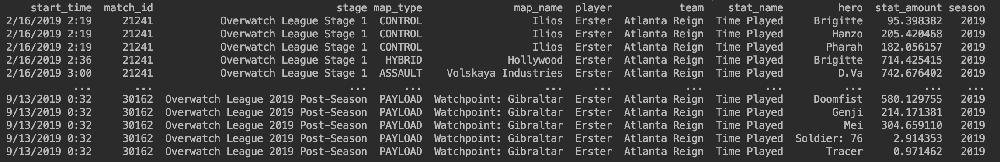
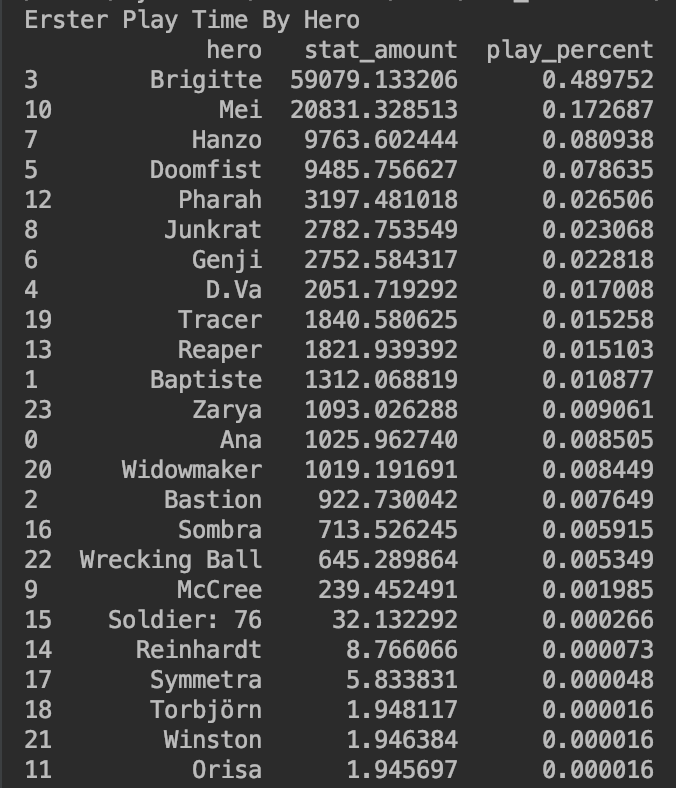
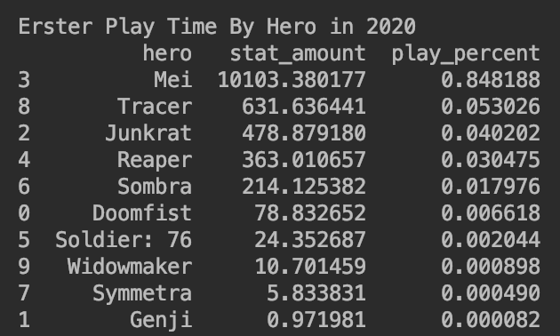

## Investigating Why Erster Isn't Playing

In this tutorial I will use the data from the stats lab page to investigate Erster's play time this season.

If you see any issues or think there is a better way to do something,
don't hesitate to open a PR, submit an issue, or reach out to me directly

### 0.1 Requirements
The code in this tutorial was written in python 3.7 and uses the following libraries:
Pandas

The environment.yml page for the entire project contains everything you need to run this script.

### 1. What is Erster's Hero Pool?

The first thing we are going to look into is what Erster's hero pool is. Based on his [Liquipedia Page](https://liquipedia.net/overwatch/Jeong_Joon) we that Erster is best at Genji, Doomfist, Pharah, Mei, and Tracer.
This matches anecdotal evidence that we have heard from various Atlanta Reign player's streams and from the league casters. Knowing this we can look into see what he has played in his time with the Atlanta Reign.

The first thing we are going to do is disable warning, import pandas, os, timezone, and datetime, and set some print options for pandas.


```python
import warnings
warnings.simplefilter(action='ignore')

import pandas as pd
import os
from pytz import timezone
import datetime


pd.set_option('display.max_columns', 500)
pd.set_option('display.width', 1000)
```

Then we are going to find all of the CSVs in the data directory, read them into dateframes, and line up the columns. We have to rename some columns because the following column names
changed from 2019 to 2020:
```
hero became hero_name
team became team_name
player became player_name
match_id became esports_match_id
stage became tournament_title
```
Also in the 2019 stage_1 file, `start_time` was called `pelstart_time`

```python
csvs = os.listdir('data') # Get all files in the data directory
frames = []

for file in csvs:
    # Read the file in as a CSV
    frame = pd.read_csv('{}/{}'.format('data', file))
    # Update column names so that they are consistent across years
    frame=frame.rename(columns={'esports_match_id': 'match_id', 'tournament_title': 'stage', 'player_name': 'player',
                          'hero_name': 'hero', 'team_name': 'team', 'pelstart_time': 'start_time'})
    # Add the dataframe to a list
    frames.append(frame)

# Concat all of the dataframes together
player_frame = pd.concat(frames)

```

We now have a dataframe containing all of the player stats from 2019 to now. Because we are only looking at Erster's hero pool, we want to filter out
all of the rows that do not contain Erster's play time information. To do that we will filter the dataframe to only take rows that contain 'Time Played' information for 'Erster' for specific heros

```python
# Filter the dataframe so that we only have Time Played Rows for Erster with specific heroes
erster_frame = player_frame[(player_frame['stat_name'] == 'Time Played') & (player_frame['player'] == 'Erster') & (player_frame['hero'] != 'All Heroes')]```

We also will want to seperate out the 2020 season from the rest of the data since this is the season where Erster has supposedly gone missing. To do that we will write a method to calculate the season from the match start time and store it as a column on the frame.

```python
# Calculate the season from datetime
def calc_season(dt):
    parsed = datetime.datetime.strptime(dt, "%m/%d/%Y %H:%M")
    return parsed.date().strftime("%Y")

# Create a season column from the start_time column
erster_frame['season'] = erster_frame['start_time'].apply(calc_season)
```

Our `erster_frame` should now look something like this:


From our dataframe of Erster's play time we can now calculate how much he has played each hero by calculating his total time played on each hero.

```python
# Calculate total time played
total_time = erster_frame['stat_amount'].sum()
# Calculate total time played per hero
play_time = erster_frame[['hero', 'stat_amount']].groupby(by='hero').sum().reset_index()
# Divide total time player per hero by total time played
play_time['play_percent'] = play_time['stat_amount'] / total_time
# Sort the results in descending order
play_time = play_time.sort_values(by='play_percent', ascending = False)
print('Erster Play Time By Hero')
print(play_time)
```

Below is Erster's hero pool for his entire OWL Career. The majority of this data is from GOATs and
before role lock so it throws a wrench in some of the numbers. We will likely never see Erster play Brig, D.Va, Zarya, Ana, or any other Tank or Support again in OWL.  <br>


We also want to look at his total time played for this season only.

```python
# Take only rows from the 2020 season
erster_2020_frame = erster_frame[(erster_frame['season'] == '2020')]
# Calculate total time played
total_time_2020 = erster_2020_frame['stat_amount'].sum()
# Calculate total time played per hero
play_time_2020 = erster_2020_frame[['hero', 'stat_amount']].groupby(by='hero').sum().reset_index()
# Divide total time player per hero by total time played
play_time_2020['play_percent'] = play_time_2020['stat_amount'] / total_time_2020
# Sort the results in descending order
play_time_2020 = play_time_2020.sort_values(by='play_percent', ascending = False)
print('Erster Play Time By Hero in 2020')
print(play_time_2020)
```

We also have his hero pool for the 2020 season. From here we can see that he has almost exclusively played Mei with a little bit of Tracer, Junkrat, Reaper and Sombra thrown in.
He has also played Doomfist and Soldier for what was likely an overtime contest, Widowmaker for what was likely an attempt at a pick out of spawn, Symmetra for a TP out of spawn, and Genji for less than a second.  <br>


From this we can see that Erster has almost exclusively played Mei this season for the Reign.

### 2. Has Erster Played the Majority of the Reign's Minutes on Mei?

