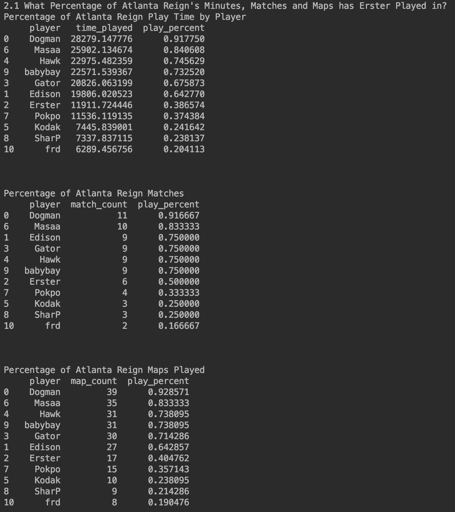

## Investigating Why Erster Isn't Playing

In this tutorial I will use the data from the stats lab page to investigate Erster's play time this season.

If you see any issues or think there is a better way to do something,
don't hesitate to open a PR, submit an issue, or reach out to me directly

### 0.1 Requirements
The code in this tutorial was written in python 3.7 and uses the following libraries:
Pandas

The environment.yml page for the entire project contains everything you need to run this script.

### 1. What is Erster's Hero Pool?

The first thing we are going to look into is what Erster's hero pool is. Based on his [Liquipedia Page](https://liquipedia.net/overwatch/Jeong_Joon) we that Erster is best at Genji, Doomfist, Pharah, Mei, and Tracer.
This matches anecdotal evidence that we have heard from various Atlanta Reign player's streams and from the league casters. Knowing this we can look into see what he has played in his time with the Atlanta Reign.

The first thing we are going to do is disable warning, import pandas, os, timezone, and datetime, and set some print options for pandas.


```python
import warnings
warnings.simplefilter(action='ignore')

import pandas as pd
import os
from pytz import timezone
import datetime


pd.set_option('display.max_columns', 500)
pd.set_option('display.width', 1000)
```

Then we are going to find all of the CSVs in the data directory, read them into dateframes, and line up the columns. We have to rename some columns because the following column names
changed from 2019 to 2020:
```
hero became hero_name
team became team_name
player became player_name
match_id became esports_match_id
stage became tournament_title
```
Also in the 2019 stage_1 file, `start_time` was called `pelstart_time`

```python
csvs = os.listdir('data') # Get all files in the data directory
frames = []

for file in csvs:
    # Read the file in as a CSV
    frame = pd.read_csv('{}/{}'.format('data', file))
    # Update column names so that they are consistent across years
    frame=frame.rename(columns={'esports_match_id': 'match_id', 'tournament_title': 'stage', 'player_name': 'player',
                          'hero_name': 'hero', 'team_name': 'team', 'pelstart_time': 'start_time'})
    # Add the dataframe to a list
    frames.append(frame)

# Concat all of the dataframes together
player_frame = pd.concat(frames)

```

We now have a dataframe containing all of the player stats from 2019 to now. Because we are only looking at Erster's hero pool, we want to filter out
all of the rows that do not contain Erster's play time information. To do that we will filter the dataframe to only take rows that contain 'Time Played' information for 'Erster' for specific heros

```python
# Filter the dataframe so that we only have Time Played Rows for Erster with specific heroes
erster_frame = player_frame[(player_frame['stat_name'] == 'Time Played') & (player_frame['player'] == 'Erster') & (player_frame['hero'] != 'All Heroes')]```

We will want to separate out the 2020 season from the rest of the data since this is the season where Erster has supposedly gone missing. To do that we will write a method to calculate the season from the match start time and store it as a column on the frame.

```python
# Calculate the season from datetime
def calc_season(dt):
    parsed = datetime.datetime.strptime(dt, "%m/%d/%Y %H:%M")
    return parsed.date().strftime("%Y")

# Create a season column from the start_time column
erster_frame['season'] = erster_frame['start_time'].apply(calc_season)
```

Our `erster_frame` should now look something like this:


From our dataframe of Erster's play time we can now calculate how much he has played each hero by calculating his total time played on each hero.

```python
# Calculate total time played
total_time = erster_frame['stat_amount'].sum()
# Calculate total time played per hero
play_time = erster_frame[['hero', 'stat_amount']].groupby(by='hero').sum().reset_index()
# Divide total time player per hero by total time played
play_time['play_percent'] = play_time['stat_amount'] / total_time
# Sort the results in descending order
play_time = play_time.sort_values(by='play_percent', ascending = False)
print('Erster Play Time By Hero')
print(play_time)
```

Below is Erster's hero pool for his entire OWL Career. The majority of this data is from GOATs and
before role lock so it throws a wrench in some of the numbers. We will likely never see Erster play Brig, D.Va, Zarya, Ana, or any other Tank or Support again in OWL.  <br>


We want to look at his total time played for this season only.

```python
# Take only rows from the 2020 season
erster_2020_frame = erster_frame[(erster_frame['season'] == '2020')]
# Calculate total time played
total_time_2020 = erster_2020_frame['stat_amount'].sum()
# Calculate total time played per hero
play_time_2020 = erster_2020_frame[['hero', 'stat_amount']].groupby(by='hero').sum().reset_index()
# Divide total time player per hero by total time played
play_time_2020['play_percent'] = play_time_2020['stat_amount'] / total_time_2020
# Sort the results in descending order
play_time_2020 = play_time_2020.sort_values(by='play_percent', ascending = False)
print('Erster Play Time By Hero in 2020')
print(play_time_2020)
```

We can also look at his hero pool for the 2020 season. From this we can see that he has almost exclusively played Mei with a little bit of Tracer, Junkrat, Reaper and Sombra thrown in.
He has also played Doomfist and Soldier for what was likely an overtime contest, Widowmaker for what looks to be an attempt at a pick out of spawn, Symmetra for a TP out of spawn, and Genji for less than a second.  <br>


From this we can see that Erster has almost exclusively played Mei this season for the Reign.

### 2. Has Erster Played the Majority of the Reign's Minutes on Mei?

#### 2.1 Breakdown of Atlanta Reign Play Time

The next thing we want to investage is how much Erster is actually playing and how that compares to his teammates.
Let's create a dataframe of playtime for Atlanta Reign only.

```python
# Filter the dataframe so that we only have Time Played Rows for Atlanta Reign with specific heroes
atlanta_frame = player_frame[(player_frame['stat_name'] == 'Time Played') & (player_frame['team'] == 'Atlanta Reign') & (player_frame['hero'] != 'All Heroes') & (player_frame['season'] == '2020')]

```

We should also write some code for breaking town play time for each player in the dataframe. we will turn this code into a function so that we can reuse it later.
```python
def play_time_breakdown(frame):
    # Total Team Play Time
    total_min = frame['stat_amount'].sum()

    # Take only the player and the time played (stat_amount), group by the player and sum up the total play time.
    ptime = frame[['player', 'stat_amount']].groupby(by='player').sum().reset_index()

    # Take only the player and the time played (stat_amount), group by the player and sum up the total play time.
    ptime['play_percent'] = ptime['stat_amount'] / total_min

    # Rename the columns
    ptime.columns = ['player', 'time_played', 'play_percent']
    # Sort in Descending Order
    ptime = ptime.sort_values(by='play_percent', ascending=False)
    return ptime
```

We will repeat  the process for maps played and matches played.

```python
def match_breakdown(frame):
    # Count the total number of matches played
    total_matchs = len(frame['match_id'].unique())
    # Take only the player and the match id, group by the player and count number of matches played.
    match_cnt = frame[['player', 'match_id']].drop_duplicates().groupby(by=['player']).count().reset_index()
    # Rename the columns
    match_cnt.columns = ['player', 'match_count']
    # Calculate the percentage of matches played
    match_cnt['play_percent'] = match_cnt['match_count'] / total_matchs
    # Sort in Descending Order
    match_cnt = match_cnt.sort_values(by='play_percent', ascending=False)
    return match_cnt


def map_breakdown(frame):
    # Count the total number of maps played
    total_maps = frame[['match_id', 'map_name']].drop_duplicates().shape[0]
    # Take only the player, the match id and the map name, group by player and count the number of maps each player played
    map_cnt = frame[['player', 'match_id', 'map_name']].drop_duplicates().groupby(
        by=['player']).count().reset_index()
    # Select only the player and the map count
    map_cnt = map_cnt[['player', 'map_name']]
    # Rename teh columns
    map_cnt.columns = ['player', 'map_count']
    # Calculate the percentage of maps played
    map_cnt['play_percent'] = map_cnt['map_count'] / total_maps
    # Sort in Descending Order
    map_cnt = map_cnt.sort_values(by='play_percent', ascending=False)
    return map_cnt
```

Applying these three functions to the dataframe of Atlanta Reign playtime results in the following tables: <br>


From these results we can see that Erster has played in 38% of Atlanta's possible minutes, 6 of the 12 matches, and 17 of the 42 maps
Atlanta has clearly preferred babybay and Edison over him this season, but what about on Mei the one character in his hero pool that has been meta this season? To break down Atlanta's Mei play time this season,
we will apply the same functions from above on just the mei play time for the Reign this season.

#### 2.2 Breakdown of Atlanta Reign Play Time on Mei

```python
# Filter the dataframe so that we only have Time Played Rows for Atlanta Reign with specific heroes
atlanta_mei_frame = player_frame[(player_frame['stat_name'] == 'Time Played') & (player_frame['team'] == 'Atlanta Reign') & (player_frame['hero'] == 'Mei') & (player_frame['hero'] != 'All Heroes') & (player_frame['season'] == '2020')]
ptime = play_time_breakdown(atlanta_mei_frame)
print('Percentage of Atlanta Reign Play Time by Player On Mei')
print(ptime)
print('\n\n')

match_cnt = match_breakdown(atlanta_mei_frame)
print('Percentage of Atlanta Reign Matches Played On Mei')
print(match_cnt)
print('\n\n')

map_cnt = map_breakdown(atlanta_mei_frame)
print('Percentage of Atlanta Reign Maps Played On Mei')
print(map_cnt)
print('\n\n')
```


These results show that Erster has played 85% of Atlanta's Mei Minutes, 75% of matches and  77% of maps where Atlanta played Mei.
This tells us that Atlanta is playing Erster in almost all cases where Atlanta is playing Mei, but what about those few maps where someone else played Mei?
Unfortunately we are limited in the data we have access to, so we will have to go to the VODs to see exactly what happened in the 5 maps Atlanta Played someone other than Erster on Mei.

1. Week 10 vs Philly:
    Edison played the first 2 maps as Mei and then was subbed out for Erster for the last 3 maps of the match.
2. Week 14 vs Houston - Oasis:
    Edison started this map playing tracer but was countered by Torb.
3. Week 14 vs Houston - King's Row:
    Edison started this map on Genji, built blade, then swapped for point 2 attack. He also played Mei on D
4. Week 16 vs Toronto - King's Row:
    babybay swapped Mei to help counter Toronto's comp.

In only 1 of these matches and 2 of these maps did Atlanta plan to play anyone other that Erster on Mei giving credence to the idea that Erster is Atlanta's main Mei player.

## 3. Is Atlanta not playing Mei when Meta?
The final thing we want to dig into is if Atlanta is benching Erster and not playing Mei when they should be?
This is an idea that has been posed by various casters and analysts and parroted by fans online. In order to determine
if Atlanta is not playing Mei when she is meta we first need to find out what weeks Mei was meta. A quick and easy way to determine if Mei is determined Meta
is to check her play time across the entire league. We will set the slightly arbitrary cutoff for Mei being meta as Mei being playing for at least 1/12th of the total play time during a match week.
This would average out to at least one team playing Mei at all times during the match week.

Because the source data does not provide the match week we need to generate that outselves.
To do this we can build a map of dates to match weeks and then apply it to our dataframe using match start time.
```python
## Build a map of Game Date to Game Week:
game_date_map = {
    '2020/02/08':1,
    '2020/02/09':1,
    '2020/02/10':1,
    '2020/02/15':2,
    '2020/02/16':2,
    '2020/02/22':3,
    '2020/02/23':3,
    '2020/02/24':3,
    '2020/02/29':4,
    '2020/03/01':4,
    '2020/03/02':4,
    '2020/03/07':5,
    '2020/03/08':5,
    '2020/03/28':8,
    '2020/03/29':8,
    '2020/03/30':8,
    '2020/04/04':9,
    '2020/04/05':9,
    '2020/04/06':9,
    '2020/04/11':10,
    '2020/04/12':10,
    '2020/04/13':10,
    '2020/04/16':11,
    '2020/04/17':11,
    '2020/04/18':11,
    '2020/04/19':11,
    '2020/04/25':12,
    '2020/04/26':12,
    '2020/05/02':13,
    '2020/05/03':13,
    '2020/05/09':14,
    '2020/05/10':14,
    '2020/05/11':14,
    '2020/05/16':15,
    '2020/05/17':15,
    '2020/05/22':16,
    '2020/05/23':16,
    '2020/05/24':16,
    '2020/05/25':16
}

def match_date_to_league_week(dt):
    parsed = datetime.datetime.strptime(dt, '%m/%d/%Y %H:%M')
    return game_date_map[parsed.date().strftime('%Y/%m/%d')]

player_frame_2020 = player_frame[player_frame['season'] == '2020']
player_frame_2020['game_week'] = player_frame_2020['start_time'].apply(match_date_to_league_week)
```

Now that we have all of the match weeks set we can group by match week and determine which heroes were played in each week.
Selecting only Mei and multiplying the percentage of total time played by 12 because of the 12 players in the game at a given time will
get us a value equivalent to average amount of Mei on the field at any given time. As we discussed earlier we will say that Mei is
meta any week that value is over 1.0, or any week that each team in a match played Mei at least half of the match.
```python
def play_time_per_match(group):
    # Calculate play percentage in each group
    total_time = group['stat_amount'].sum()
    group['percent_played'] = group['stat_amount'] / total_time
    return group

# Determine weeks that OWL as a whole thought that Mei was meta
# Calculate play percentage of each hero in each week
week_pct = player_frame_2020.groupby(by='match_week').apply(play_time_per_match).reset_index()
# Group by match week and hero and sum out total play time and percentage so we have a breakdown per hero by week.
week_pct = week_pct[['hero', 'match_week', 'percent_played']].groupby(by=['match_week', 'hero']).sum().reset_index()

# Select only Mei
mei_week = week_pct[week_pct['hero'] == 'Mei']
# Multiply by 12 to get the Percent of time played per match week. We multiply by 12 because there are 12 players (6 players on 2 teams)
# in the game at any given time. If Mei had a percent_of_time_played of 2.0 it means that Mei was played at all times during the week
mei_week['percent_of_time_played'] = mei_week['percent_played'] * 12
# Weeks where Mei was played at least half the time by each team are weeks that we determine Mei to be meta
mei_week['meta'] = mei_week['percent_of_time_played'] >= 1
print('Mei Play Time per Week')
print(mei_week)
```
Running the above code will generate the table below. From the results we can see that Mei was meta by our standards in weeks 1, 2, 3, 4, 10, and 12.
In weeks 8, 11, and 14 she was close to being meta, but just missed our cutoffs.
<br>


Now that we have the weeks that the league thoguth that Mei was meta, we should look to see which of those weeks
Atlanta Reign played, Erster Played, and Atlanta Reign considered Mei meta by playing her at least half the time. This can be done easily
by selecting only weeks where Erster shows up in our original player dataframe, selecting weeks Atlanta Reign show up in our original player frame,
and performing the above analysis on only rows involving the Atlanta Reign.

```python
# Determine weeks that Atlanta reign thought Mei was Meta
# Select only player rows for Atlanta Reign players
atlanta_player_frame_2020 = player_frame_2020[player_frame_2020['team'] == 'Atlanta Reign']
# Group by match week and calculate the play time for each player hero combination.
atlanta_week_pct = atlanta_player_frame_2020.groupby(by='match_week').apply(play_time_per_match).reset_index()
# Group by match week and hero and sum up total hero play time for each combination.
atlanta_week_pct = atlanta_week_pct[['hero', 'match_week', 'percent_played']].groupby(by=['match_week', 'hero']).sum().reset_index()
# Select only Mei Rows
atlanta_mei_week = atlanta_week_pct[atlanta_week_pct['hero'] == 'Mei']
# Multiply by 6 to get the percentage of time Mei was in the game for the Reign
atlanta_mei_week['percent_of_time_played'] = atlanta_mei_week['percent_played'] * 6
# Determine which weeks Atlanta played Mei for at least half the match
atlanta_mei_week['meta'] = atlanta_mei_week['percent_of_time_played'] >= 0.5
print('Atlanta Mei Play Time per Week')
print(atlanta_mei_week)
# Only select weeks where the Reign determined that Mei was meta
atlanta_mei_week_meta_only = atlanta_mei_week[atlanta_mei_week['meta']]
atlanta_mei_weeks_list = atlanta_mei_week_meta_only['match_week']

print('\n\n')
print('Weeks that OWL as a whole thought that Mei was meta')
print(list(mei_weeks_list))

print('Weeks that Atlanta reign Played')
print(list(atlanta_player_frame_2020['match_week'].unique()))

# Select weeks that Erster Played
erster_player_frame_2020 = player_frame_2020[player_frame_2020['player'] == 'Erster']
print('Weeks that Erster Played')
print(list(erster_player_frame_2020['match_week'].unique()))

print('Weeks that Atlanta thought that Mei was meta')
print(list(atlanta_mei_weeks_list))

```
<br>


#### What happened Week 10?
Week 10 is the only week that Atlanta played, the league as a whole considered Mei meta, but atlanta did not play Mei enough
to cross our meta threshold. Digging into the data for week 10 we find that Erster played a little over 50% of his possible play time that
week and in 3 of the 5 maps. This lines up with what we said in a previous section. Atlanta played Edison for the first 2 maps of week 10 vs philly
then subbed him out for Erster for the last 3 maps. Atlanta clearly thought that they had a better comp for that week and after dropping the first
two maps then decided to adjust to a better comp that included Erster.

```python
# We see from the lists above that the only week Atlanta did not play Mei enough to meet our meta requirements when the
# league as a whole considered her meta was week 10 vs Philly. We can dig in and see what happened in week 10
print('Did Erster Play all of week 10?')
week_10_atl = atlanta_player_frame_2020[atlanta_player_frame_2020['match_week'] == 10]
week_10_play_time = play_time_breakdown(week_10_atl)
print('Play Time Breakdown for Atlanta Reign Week 10')
print(week_10_play_time)

print('\n\n')
week_10_map = map_breakdown(week_10_atl)
print('Map Breakdown for Atlanta Reign Week 10')
print(week_10_map)
```
<br>


The final script for generating all of this data can be found [here](investigate_erster.py).
