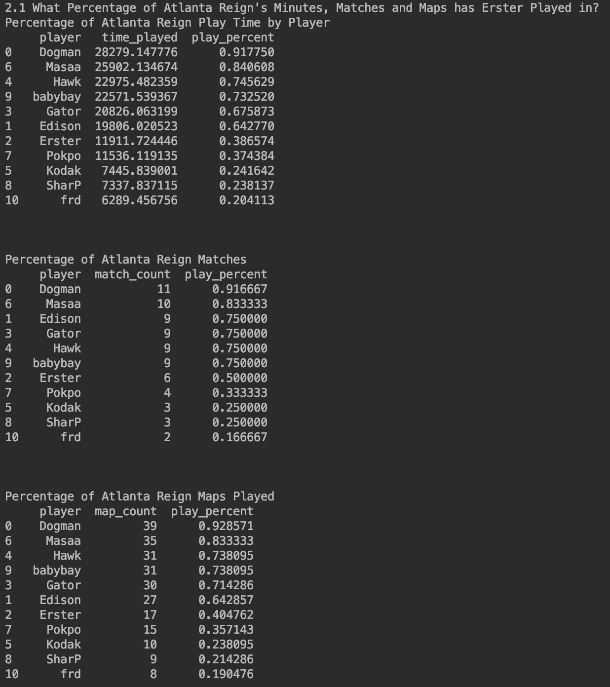
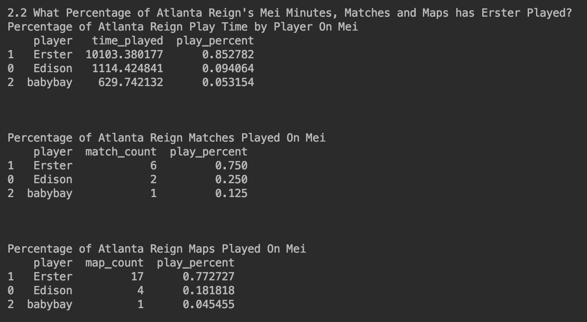

## Investigating Why Erster Isn't Playing

Where is Erster? It's a question that has been asked constantly over the last few weeks by fans and analysts alike.
It has been asked to each of the play Reign players on stream, with babybay and dogman both saying that Erster's hero pool just hasn't been meta.
Dogman has been asked about erster so much by fans that he added a twitch command `!erster` to his channel to link a [clip of his explanation](https://www.twitch.tv/dogman/clip/GeniusModernDonkeyOSfrog).
[Plat Chat](https://youtu.be/6yqtS6xK0JI?t=1380) even did an entire segment on it last week which inspired me to research this further.

### 1. What is Erster's Hero Pool?

The first thing we are going to look into is what is Erster's hero pool. Based on his [Liquipedia Page](https://liquipedia.net/overwatch/Jeong_Joon) Erster's main heroes are Genji, Doomfist, Pharah, Mei, and Tracer.
This matches anecdotal evidence that we have heard from various Atlanta Reign player's streams and from the league casters. We can also look at what he has played during his time with the Reign and what he has played this year in particular.

Below is Erster's hero pool for his entire OWL Career. The majority of this data is from GOATs and
before role lock so it throws a wrench in some of the numbers. We will likely never see Erster play Brig, D.Va, Zarya, Ana, or any other Tank or Support again in OWL.  

If we narrow our scope down to this season only  we can see that he has almost exclusively played Mei with a little bit of Tracer, Junkrat, Reaper and Sombra thrown in.
He has also played Doomfist and Soldier for what was likely an overtime contest, Widowmaker for what looks to be an attempt at a pick out of spawn, Symmetra for a TP out of spawn, and Genji for less than a second.   

Of the Heroes that Erster has routinely played in OWL, only Mei and Tracer have been meta this season.
Other Reign players have said that Edison is the teams first choice for tracer, so that leaves Erster with Mei.
Knowing this we should look at how much play time Erster has actually had this season, and how much of Atlanta's Mei play time has been given to Erster.
 

Breaking down Atlanta's total play time, it can be seen that Erster has played 38% of his possible minutes for Reign this season,
50% of the Reigns matches, and 40% of the Reigns maps. This does seem pretty low for someone who many have called Atlanta's star DPS player.
However as we've been told and as we saw above, Mei is really the only hero that has been meta that he plays. Because of this we should look at who is taking up the play time at Mei for the Reign this season.
 

