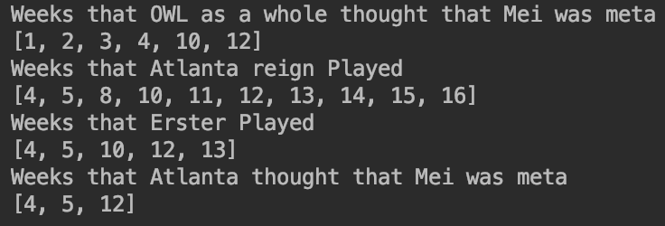

## Investigating Why Erster Isn't Playing

Where is Erster? It's a question that has been asked constantly over the last few weeks by fans and analysts alike.
It has been asked to each of the play Reign players on stream, with babybay and dogman both saying that Erster's hero pool just hasn't been meta.
Dogman has been asked about erster so much by fans that he added a twitch command `!erster` to his channel to link a [clip of his explanation](https://www.twitch.tv/dogman/clip/GeniusModernDonkeyOSfrog).
[Plat Chat](https://youtu.be/6yqtS6xK0JI?t=1380) even did an entire segment on it last week which inspired me to research this further.

### 1. What is Erster's Hero Pool?

The first thing we are going to look into is what is Erster's hero pool. Based on his [Liquipedia Page](https://liquipedia.net/overwatch/Jeong_Joon) Erster's main heroes are Genji, Doomfist, Pharah, Mei, and Tracer.
This matches anecdotal evidence that we have heard from various Atlanta Reign player's streams and from the league casters. We can also look at what he has played during his time with the Reign and what he has played this year in particular.

Below is Erster's hero pool for his entire OWL Career. The majority of this data is from GOATs and
before role lock so it throws a wrench in some of the numbers. We will likely never see Erster play Brig, D.Va, Zarya, Ana, or any other Tank or Support again in OWL.  

If we narrow our scope down to this season only  we can see that he has almost exclusively played Mei with a little bit of Tracer, Junkrat, Reaper and Sombra thrown in.
He has also played Doomfist and Soldier for what was likely an overtime contest, Widowmaker for what looks to be an attempt at a pick out of spawn, Symmetra for a TP out of spawn, and Genji for less than a second.   

### 2. Has Erster Played the Majority of the Reign's Minutes on Mei?
Of the Heroes that Erster has routinely played in OWL, only Mei and Tracer have been meta this season.
Other Reign players have said that Edison is the teams first choice for tracer, so that leaves Erster with Mei.
Knowing this we should look at how much play time Erster has actually had this season, and how much of Atlanta's Mei play time has been given to Erster.
 

Breaking down Atlanta's total play time, it can be seen that Erster has played 38% of his possible minutes for Reign this season,
50% of the Reigns matches, and 40% of the Reigns maps. This does seem pretty low for someone who many have called Atlanta's star DPS player.
However as we've been told and as we saw above, Mei is really the only hero that has been meta that he plays. Because of this we should look at who is taking up the play time at Mei for the Reign this season.
 

As any good analyst will tell you, you can't just look at the numbers, you need to combine it with film,
so I decided to dig into see what happened in the maps where Atlanta played Mei without Erster and found some pretty reasonable siutations.

1. Week 10 vs Philly:
    Edison played the first 2 maps and then was subbed out for Erster for the last 3 maps of the match.
2. Week 14 vs Houston - Oasis:
    Edison started this map playing tracer but was countered by Torb.
3. Week 14 vs Houston - King's Row:
    Edison started this map on Genji, built blade, then swapped for point 2 attack. He also played Mei on D
4. Week 16 vs Toronto - King's Row:
    babybay swapped Mei to help counter Toronto's comp.

Out of these scenarios the only one that raises any flags is week 10 vs Philly. Atlanta started out with Edison playing a litany of heroes including Mei and was subbed out for Erster on Mei at halftime.
The other cases were just switches because Atlanta's comp was being counter or to counter the other team's comp.

## 3. Is Atlanta not playing Mei when Meta?

The final thing I wanted to explore was if Atlanta was not playing Mei when she was considered meta?
It is a claim i've seen parroted online and was even mentioned in the Plat Chat episode referenced above.
In order to determine if Atlanta is not playing Mei when she is meta I first needed to find out what weeks Mei was meta. A quick and easy way to determine if Mei is meta in a particular week
is to check her play time across the entire league. If I set an arbitrary cutoff for Mei being meta as Mei being played for at least 1/12th of the total play time during a match week it would equate to each team playing Mei at least half the time in their matches.
It seems like a reasonable cutoff for determining if a hero is in that week's meta. We should also check to see which weeks Atlanta played Mei at that same rate to see if Atlanta was playing Mei when she was meta.
If they have not been playing Mei when she was meta then it would line up with this idea that they have unnecessarily bench Erster for inferior comps.
 

 

From the results we see that Mei was considered meta in weeks 1, 2, 3, 4, 10 and 12
Atlanta only played in weeks 4, 5, 8, 10, 11, 12, 13, 14, 15, and 16
Erster played in weeks 4, 5, 10, 12, and 13
Atlanta played Mei more than 50% of the time during weeks 4, 5, and 12

Week 10 is the only week where atlanta didn't run Mei comps when the arguably should have, and as we discussed above, they swapped after game 2 that week to play more Mei comps with Erster on the Mei.

From all of this above we can see that Atlanta has consistently played Mei comps in weeks where they were considered meta, That when they plan to play Mei comps, Erster is on the Mei.
We also know based on limited public information what Erster's hero pool is and that outside of Mei and Tracer those heroes have not been played this season.
I believe that unless someone comes forward inside information to the contrary we can only take what the Reign players have said at face value and accept that Erster is not playing due to what heroes have been in the meta so far this season.
