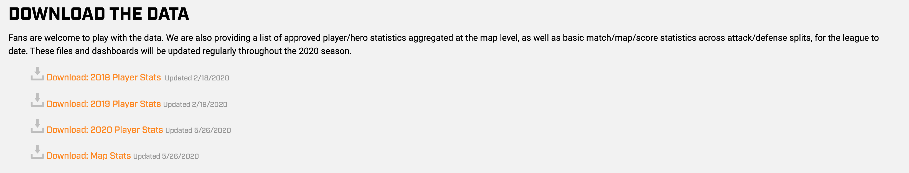
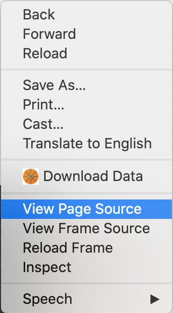
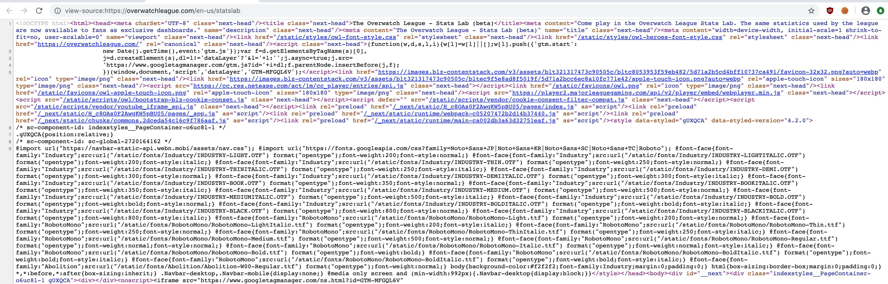
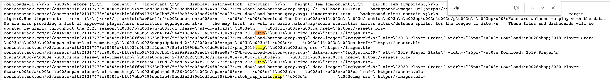
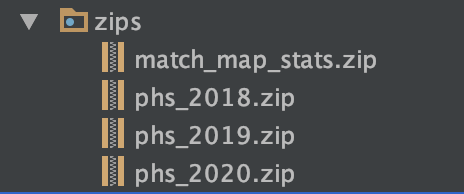
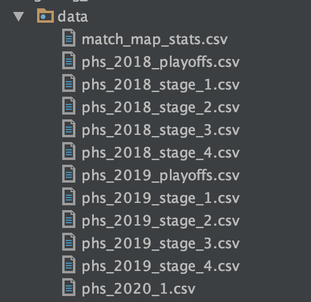

## Automate the Download and Extraction of StatsLab Data

In this tutorial I will show you how to download and extract data from the StatsLab page on the Overwatch League page.

If you see any issues or think there is a better way to do something,
don't hesitate to open a PR, submit an issue, or reach out to me directly

### 0.1 Requirements
This tutorial uses the latest version of Google Chrome for finding the endpoint information.
The code in this tutorial was written in python 3.7 and uses the following libraries:
Pandas
Requests

The environment.yml page for the entire project contains everything you need to run this script.


### 1. Where to download the data?

All data can be manually downloaded from https://overwatchleague.com/en-us/statslab .



There are four zip files here containing team stats per map played and player stats for each season.
These can easily be manually downloaded,
but I'm lazy and want to automate this so I only have to click a button
and have my data update on its own. To do this we will write a script to find the links to download the zip files on the page,
extract the zip files, and save the csv files contained within.

#### 1.1 Find the links to the zip files
The first think we want to do is go look at the source for the page.
You can view any page source in Chrome by right-clicking the page and selecting "View Source"


That will open a new tab with the source of the page:


We can now search the source for the links to the zip files by searching the page for ".zip"


Now that we have found the 4 zip files, we can look to find a pattern so that we can use regex to extract the links.

1. https://assets.blz-contentstack.com/v3/assets/blt321317473c90505c/bltc1b83b55692b42f4/5e4c1368de213a0dff736e29/phs_2018.zip
2. https://assets.blz-contentstack.com/v3/assets/blt321317473c90505c/blt034e0b484f2dae47/5e4c1369b6a7c40dd9c69e9f/phs_2019.zip
3. https://assets.blz-contentstack.com/v3/assets/blt321317473c90505c/blt7e0ffce2b617f0d2/5ecd3a75a84f2107d1775f56/phs_2020.zip
4. https://assets.blz-contentstack.com/v3/assets/blt321317473c90505c/blt67ebb7496ecd1ac4/5ecd3a5d80e1cd5cdc708bb6/match_map_stats.zip

Just from looking at the links, they seem to be some sort of fingerprinted assets so we can not expect the links to be consistent.
Because we can not expect the links to remain consistent, we need to extract them from the page every time we want to download. The simplest pattern to extract these links is to
pull everything between `https://assets` and `.zip`. The regex for this would be `r'(https://assets.*?.zip)'`


The script below will go to the statslab page, convert the source to a string, and extract all links that match out pattern into a list
```python
import requests
import re

# Make a request to get the html of the overwatch league stats lab page
resp_text = requests.get("https://overwatchleague.com/en-us/statslab").text

# Regex extract all zip file hrefs on the page
links = re.findall( r'(https://assets.*?.zip)', resp_text)

for l in links:
    print(l)
```
This will print out the links we found above:
```
https://assets.blz-contentstack.com/v3/assets/blt321317473c90505c/bltc1b83b55692b42f4/5e4c1368de213a0dff736e29/phs_2018.zip
https://assets.blz-contentstack.com/v3/assets/blt321317473c90505c/blt034e0b484f2dae47/5e4c1369b6a7c40dd9c69e9f/phs_2019.zip
https://assets.blz-contentstack.com/v3/assets/blt321317473c90505c/blt7e0ffce2b617f0d2/5ecd3a75a84f2107d1775f56/phs_2020.zip
https://assets.blz-contentstack.com/v3/assets/blt321317473c90505c/blt67ebb7496ecd1ac4/5ecd3a5d80e1cd5cdc708bb6/match_map_stats.zip
```

#### 1.2 Downloading the zip files
Since we will be downloading the zip files, extracting from them, and saving the csv files to directories, we should
import the os and zipfile libraries.
```python
import os
import zipfile
```

We should also create a directory to save the zip files in. To do this we will check to see if the zip directory exists
and if not create it.

```python
# Save the zip folder name to a variable so that we can easily use it later.
zip_dir_name = 'zips'

# Create a zips directory if it doesn't exist
if not os.path.isdir(zip_dir_name):
    os.mkdir(zip_dir_name)
```

Now that we have a place to save the zip files, let's download each zip file and save it to that directory.
Each link has a file name at the end that we will extract and use to the name the file. We make a request, stream read it, and save the file to our intended directory.

```python
for l in links:
    # Pull the zip name from the href
    zip_name = l.split('/')[-1]

    # Make a request to get the zip file
    r = requests.get(l, stream=True)

    # save the zip file into the zips folder
    with open('{}/{}'.format(zip_dir_name, zip_name), 'wb') as fd:
        for chunk in r.iter_content(chunk_size=512):
            fd.write(chunk)
```

Once we have run this section of the script we will have a folder called `zips` with the four zip files saved in it.


#### 1.3 Extracting CSV from Zip files.

Like with the zip files, we should create a directory to save the csv files in. To do this we will check to see if the csv directory exists
and if not create it. We then use the zipfile library to open the zip files and extract them into the csv directory.

```python
data_dir_name = 'data'

# Create a data directory if it doesn't exist
if not os.path.isdir(data_dir_name):
    os.mkdir(data_dir_name)

for z in os.listdir(zip_dir_name):
    with zipfile.ZipFile('{}/{}'.format(zip_dir_name, z), 'r') as zip_ref:
        zip_ref.extractall(data_dir_name)
```

Once this section of the code has been run all of the csv files will be extracted and saved in the data folder.


The entire script can be found [Here](download_data.py)