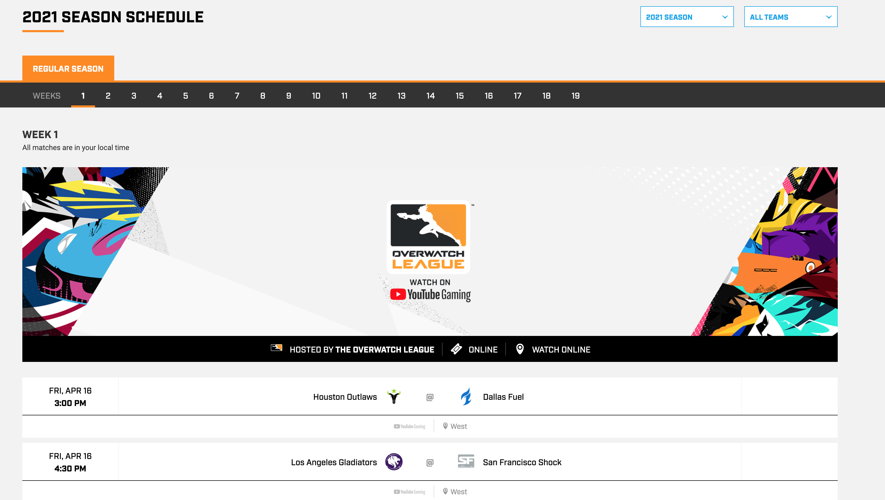
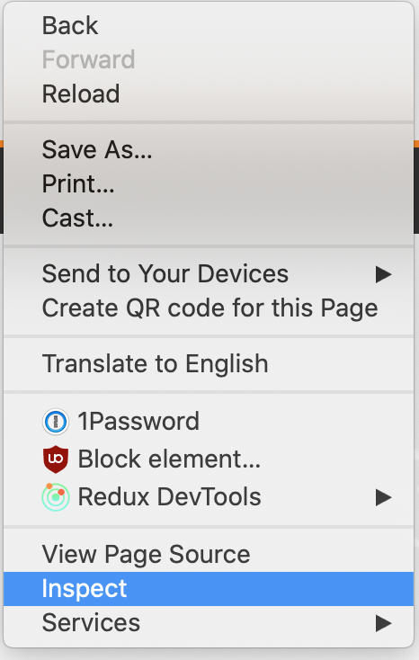
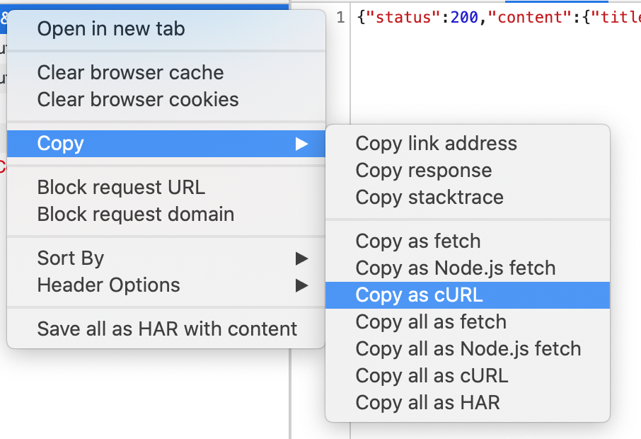

## Automate the Download and Extraction of the League Schedule

In this tutorial I will show you how to get the Overwatch League schedule from Overwatch League schedule page.

If you see any issues or think there is a better way to do something,
don't hesitate to open a PR, submit an issue, or reach out to me directly

### 0.1 Requirements
In section 1, we use Google Chrome with the developer tools enabled in order to find the endpoint.

The code in this tutorial was written in python 3.7 and uses the following libraries:
Pandas
Requests

The environment.yml page for the entire project contains everything you need to run this script.


### 1. Finding the endpiont

The first thing to do when trying to find an endpoint is to go to the page with the data we want access to.
If we want to download the league schedule we will need to go to the [league schedule page](https://overwatchleague.com/en-us/schedule?stage=regular_season&week=1)



Once there, right click the page and select inspect



Go to the network tab, click on XHR and reload the page. This section will populate with any xml http requests your browser makes.


Right click the request to league schedule endpoint and copy as a cUrl



The cUrl is shown below. From here we can extract the endpoint, query params and headers necessary to make the request ourselves.


```
curl 'https://wzavfvwgfk.execute-api.us-east-2.amazonaws.com/production/owl/paginator/schedule?stage=regular_season&page=1&season=2021&locale=en-us' \
  -H 'authority: wzavfvwgfk.execute-api.us-east-2.amazonaws.com' \
  -H 'sec-ch-ua: "Google Chrome";v="89", "Chromium";v="89", ";Not A Brand";v="99"' \
  -H 'x-origin: overwatchleague.com' \
  -H 'sec-ch-ua-mobile: ?0' \
  -H 'user-agent: Mozilla/5.0 (Macintosh; Intel Mac OS X 10_15_7) AppleWebKit/537.36 (KHTML, like Gecko) Chrome/89.0.4389.114 Safari/537.36' \
  -H 'accept: */*' \
  -H 'origin: https://overwatchleague.com' \
  -H 'sec-fetch-site: cross-site' \
  -H 'sec-fetch-mode: cors' \
  -H 'sec-fetch-dest: empty' \
  -H 'referer: https://overwatchleague.com/' \
  -H 'accept-language: en-US,en;q=0.9' \
  --compressed
```


### 2. Downloading the league schedule

We will start the same way we always do by importing pandas, datetime and requests and
setting a couple of basic pandas settings to make printing dataframes more user friendly.
```python
import requests
import pandas as pd
import datetime

pd.set_option('display.max_columns', 500)
pd.set_option('display.width', 1000)
```


Create a dictionary of the headers from the cUrl. I have already tested the headers to determine which are required for the endpoint to work. Only x-origin and referer are required.
```python
# Required headers for the API
headers = {
    'x-origin': 'overwatchleague.com',
    'referer': 'https://overwatchleague.com/',
}
```

We will also create a function that takes in a number representing the league week and returns the json response from the league schedule endpoint.
```pyhthon
# A function to call the league schedule endpoint and return the json response
def download_week(week):
    # Query params required for calling the endpoint. The endpoint is paged by league week.
    params = (
        ('stage', 'regular_season'),
        ('page', week),
        ('season', '2021'),
        ('locale', 'en-us'),
    )

    # Call the endpoint with the required headers and query params
    response = requests.get('https://wzavfvwgfk.execute-api.us-east-2.amazonaws.com/production/owl/paginator/schedule', headers=headers, params=params)
    return response.json()

```


```python
# A function to convert the response json to a dataframe of league matches
def extract_matches(events, week):
    matches = []
    for e in events:
        # isEncore is a field that determines if the match is the original play (false) or if the match is being replayed in a different timezone (true)
        # Team Name = TBD is for tournament matches where the matches haven't been determined yet.
        if (not e['isEncore']) and (e['competitors'][0]['name'] != "TBD") and (e['competitors'][1]['name'] != "TBD"):
            # Convert each item in the league schedule into an object we can use to build our league schedule
            matches.append({
                'week': week,
                'startDate': datetime.datetime.fromtimestamp(e['startDate']/1000).strftime('%Y-%m-%d'),
                'startDateTime': e['startDate'],
                'team1Id': e['competitors'][0]['id'],
                'team1Name': e['competitors'][0]['name'],
                'team1ShortName': e['competitors'][0]['abbreviatedName'],
                'team2Id': e['competitors'][1]['id'],
                'team2Name': e['competitors'][1]['name'],
                'team2ShortName': e['competitors'][1]['abbreviatedName'],
            })
    return matches
```

```python
# Call the league schedule api and extract the data for the specified week
def get_week_matches(week):
    week_resp = download_week(week)
    return extract_matches(week_resp['content']['tableData']['events'][0]['matches'], week)

weeks = []
for w in range(1, 20):
    weeks = weeks + get_week_matches(w)

frame = pd.DataFrame(weeks)

print(frame)
frame.to_csv('2021_league_schedule.csv')

```