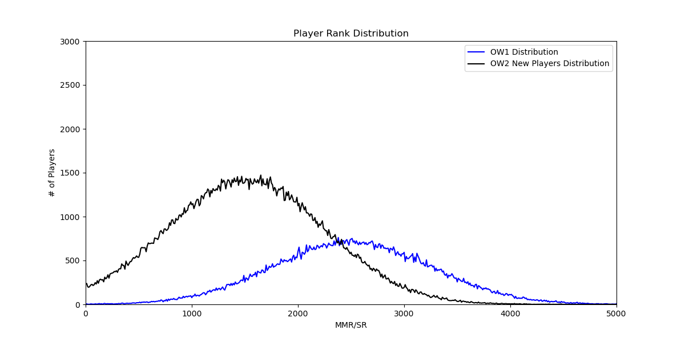
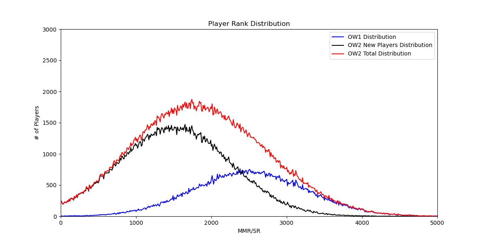
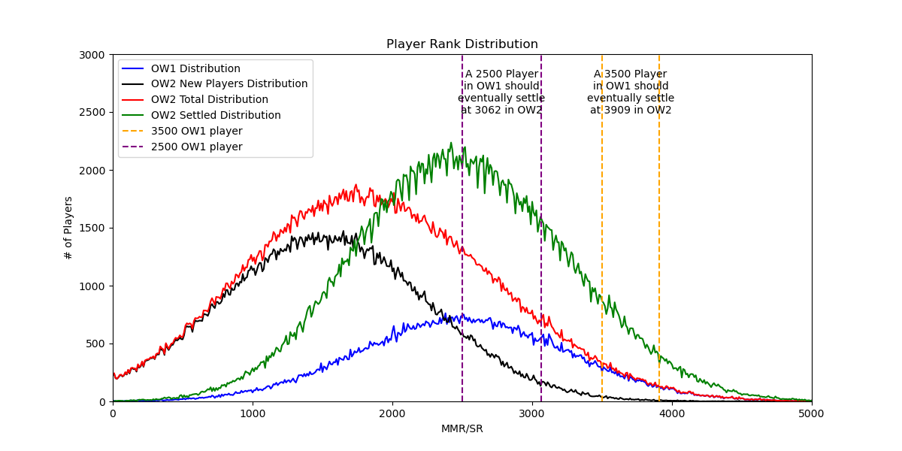

# Though Experiment: Overwatch 2 MMR Distribution
### TL;DR
Due to the introduction of a massive population of new players to the ranked system with a below average true skill, 
players who were at or above average in OW1 will climb in OW2 without any change in true skill. A plat player from OW1 
with high diamond/low masters MMR isn't necessarily the result of the matchmaker failing, but a result of the influx of new low ranked
players shifting the distribution left and lowering the "average" skill of the community.

### What Happens When You Flood The Population With Low MMR Players
There have been many observations and complaints about the match making for OW2, specifically seeing players in ranks 
significantly higher than their peak in OW1. This has lead to complaints of a broken matchmaker that is boosting players 
to new peaks. There obviously could be issues with the matchmaker and ranking system, and it can easily be argued that it
should be tuned towards higher quality games over shorter queues, however a major factor that is completely being ignored
is the massive influx of new players.

### Simple Example
Let's start with a simple example so that we can see how it works at a small scale. Once we go through this, we will move
onto an example estimating the entire overwatch population.

First we can start will a simple 10 value distribution
```
The Original Distribution is [0, 1, 3, 3, 5, 5, 5, 5, 7, 7, 9, 10]
It has a mean of 5.0 and stdev of 2.86
```
Using the mean and standard deviation, we can calculate the z-score of every value between 0-10. Then given the z score
we can use a cumulative distribution function to determine the percentile of that value.
```
z = (value - mean) / stdev
percentile = stats.norm.cdf(z)

A Value of 0 as a Z-score of -1.75 and is in the 4.01 Percentile of values
A Value of 1 as a Z-score of -1.4 and is in the 8.08 Percentile of values
A Value of 2 as a Z-score of -1.05 and is in the 14.69 Percentile of values
A Value of 3 as a Z-score of -0.7 and is in the 24.2 Percentile of values
A Value of 4 as a Z-score of -0.35 and is in the 36.32 Percentile of values
A Value of 5 as a Z-score of 0.0 and is in the 50.0 Percentile of values
A Value of 6 as a Z-score of 0.35 and is in the 63.68 Percentile of values
A Value of 7 as a Z-score of 0.7 and is in the 75.8 Percentile of values
A Value of 8 as a Z-score of 1.05 and is in the 85.31 Percentile of values
A Value of 9 as a Z-score of 1.4 and is in the 91.92 Percentile of values
A Value of 10 as a Z-score of 1.75 and is in the 95.99 Percentile of values
```
Now let's see happens if we double our population, but heavily skew the new values to the left side of the distribution.
```
We will add the following values to our distribution [0, 1, 1, 2, 2, 3, 3, 4, 5, 8]
Our new distribution is [0, 0, 1, 1, 1, 2, 2, 3, 3, 3, 3, 4, 5, 5, 5, 5, 5, 7, 7, 8, 9, 10]
The new distribution has a mean of 4.05 and stdev of 2.79
```
Given that the population mean shifted left, we can recalculate the z-score and percentile using the new mean and standard deviation
```
A Value of 0 as a Z-score of -1.45 and is in the 7.34 Percentile of values
A Value of 1 as a Z-score of -1.09 and is in the 13.73 Percentile of values
A Value of 2 as a Z-score of -0.73 and is in the 23.15 Percentile of values
A Value of 3 as a Z-score of -0.38 and is in the 35.38 Percentile of values
A Value of 4 as a Z-score of -0.02 and is in the 49.35 Percentile of values
A Value of 5 as a Z-score of 0.34 and is in the 63.4 Percentile of values
A Value of 6 as a Z-score of 0.7 and is in the 75.84 Percentile of values
A Value of 7 as a Z-score of 1.06 and is in the 85.54 Percentile of values
A Value of 8 as a Z-score of 1.42 and is in the 92.2 Percentile of values
A Value of 9 as a Z-score of 1.78 and is in the 96.22 Percentile of values
A Value of 10 as a Z-score of 2.14 and is in the 98.37 Percentile of values
```
There is a catch though, the system is designed to be centered at 5, so as more matches are played, things will stabilize and re-center
```
A Value of 0 will settle at 0.94
A Value of 1 will settle at 1.94
A Value of 2 will settle at 2.95
A Value of 3 will settle at 3.95
A Value of 4 will settle at 4.95
A Value of 5 will settle at 5.96
A Value of 6 will settle at 6.96
A Value of 7 will settle at 7.97
A Value of 8 will settle at 8.97
A Value of 9 will settle at 9.98
A Value of 10 will settle at 10.98
```
### OW1 Distribution
Now that we've looked at the simple example, lets attempt to do the same for the OW player population. In order to do
this we need to make some assumptions:
1. The OW1 MMR distribution was centered at 2500, with a standard deviation of 750. (This creates a distribution close to the distribution last time blizzard reported it in 2019)
2. The New players true skill scaled in MMR is centered at 1500 with a standard deviation of 750. (This is a guess. We know blizzard started dropping new players in bronze 5 due to their win rates, but beyond that we know nothing)
3. The MMR system is capped between 0 and 5000 and when settled is centered at 2500 with a standard deviation of 750. (Once enough games are played and every thing is settled, we should expect the system to return to where is historically has been stable)
4. The number of players who have played OW2 is 40MM. 
5. 1% of players play ranked, and of those, only 1/4 of them played ranked in OW1 

Given the above assumptions we can plot the distribution of OW1 players prior to the launch of OW2


### New Player Distribution
Now we want to look at the distribution of new ranked players being added to the population


### Combined Distribution
We then want to merge these counts together to get a look at the combined distribution of all ranked players


### Settled Distribution
Because we are assuming that the distribution is capped between 0 and 5000 and that the mean should settle at 2500, we
take the percentiles from our distribution and convert them to expected MMR values once the system has settled back into 
its stable state.



Under this settled distribution, MMR values would change as follows:
```
An MMR of 1000 (0.022750131948179195 in OW1) in OW2 will roughly translates to an MMR of 1794.0544165546535 (0.17328561860966668 in OW2) in OW1 once ranks have settled
An MMR of 1250 (0.0477903522728147 in OW1) in OW2 will roughly translates to an MMR of 2005.8054673971653 (0.2549716305370602 in OW2) in OW1 once ranks have settled
An MMR of 1500 (0.09121121972586788 in OW1) in OW2 will roughly translates to an MMR of 2217.5565182396776 (0.35323867373573925 in OW2) in OW1 once ranks have settled
An MMR of 1750 (0.15865525393145707 in OW1) in OW2 will roughly translates to an MMR of 2429.30756908219 (0.462452672381909 in OW2) in OW1 once ranks have settled
An MMR of 2000 (0.2524925375469229 in OW1) in OW2 will roughly translates to an MMR of 2641.0586199247023 (0.5745923092779993 in OW2) in OW1 once ranks have settled
An MMR of 2250 (0.36944134018176367 in OW1) in OW2 will roughly translates to an MMR of 2852.8096707672144 (0.6809699732232941 in OW2) in OW1 once ranks have settled
An MMR of 2500 (0.5 in OW1) in OW2 will roughly translates to an MMR of 3064.560721609727 (0.7741992085193782 in OW2) in OW1 once ranks have settled
An MMR of 2750 (0.6305586598182363 in OW1) in OW2 will roughly translates to an MMR of 3276.311772452239 (0.8496847758314965 in OW2) in OW1 once ranks have settled
An MMR of 3000 (0.7475074624530771 in OW1) in OW2 will roughly translates to an MMR of 3488.062823294751 (0.906150573543691 in OW2) in OW1 once ranks have settled
An MMR of 3250 (0.8413447460685429 in OW1) in OW2 will roughly translates to an MMR of 3699.813874137263 (0.9451731758535523 in OW2) in OW1 once ranks have settled
An MMR of 3500 (0.9087887802741321 in OW1) in OW2 will roughly translates to an MMR of 3911.5649249797752 (0.9700878685120566 in OW2) in OW1 once ranks have settled
An MMR of 3750 (0.9522096477271853 in OW1) in OW2 will roughly translates to an MMR of 4123.315975822288 (0.9847839847542328 in OW2) in OW1 once ranks have settled
An MMR of 4000 (0.9772498680518208 in OW1) in OW2 will roughly translates to an MMR of 4335.067026664802 (0.9927925813027697 in OW2) in OW1 once ranks have settled
An MMR of 4250 (0.9901846713713547 in OW1) in OW2 will roughly translates to an MMR of 4546.8180775073115 (0.9968245389967686 in OW2) in OW1 once ranks have settled
```

### Concluding Thoughts
This is not an analysis of the actual ranked system, but instead a thought exercise around a theory that could explain some
issues and complaints we've seen with the system. All numbers in this exercise are based on assumptions and estimates and 
therefore should not be seen as fact. One could make a compelling argument that the matchmaker isn't tuned for tight enough games and/or
that the ranks should be scaled with a more narrow standard distribution so that GM goes from 2.5% of players down to <1% of players in order to
prevent this influx of plays from boosting MMR at the tails. Just remember that next time see someone who was 2900 peak in OW1 in a GM lobby,
it's not necessarily that the matchmaker is looking too wide, but that the population increase shifting the average skill of the player base down
will lead to an increase in size of your top X% of players.