## An exploration of how the hitscan falloff nerf interacts with pharmacy
In this exploration we will be exploring how the most recent hitscan falloff changes
impact the ability for hitscan heroes to kill a Pharah with and without a mercy pocket.

### 0.1 Requirements
The code in this tutorial was written in python 3.7 and uses the following libraries:
python 3.7
The environment.yml page for the entire project contains everything you need to run this script.

The code used to generate the [DPS and TTK Graphs](./killing_pharmacy.py), the [Comparison Pre and Post Patch](./killing_pharmacy_compare.py), and
determining the [break points](./explore.py) are all provided with annotations.

### 0.2 The Change

```
Hitscan damage now scales to 30% at maximum falloff range, down from 50% for the following heroes:
- Ashe
- Baptiste
- Bastion
- McCree
- Soldier: 76
- Widowmaker
- Wrecking Ball
```
We will be assuming that falloff in overwatch is linear, or that the damage decrease from N + 0 to N + 1 meters is the 
same as the damage decrease from N + 1 meters to N + 2 meters.

How this change impacts each here can be seen below.
1. [Ashe](#10-ashe)
2. [McCree](#20-mccree)
3. [Soldier](#30-soldier)
4. [Baptiste](#30-baptiste)

### 1.0 Ashe
Ashe has two modes of fire, ASD and hip fire. We will explore both of these in this section.
#### ASD
When aiming down sights Ashe's effective range is within 30 meters, her falloff range is between 30-50 meters, and while in her
effective range a shot does 75 damage. Her recovery time is .65 seconds, allowing her to shoot ~1.54 shots per second 

Under the new falloff changes:
```
Range at which Ashe ASD can no longer kill Pharmacy with a crit rate of 0%: 45 meters

Range at which Ashe ASD can no longer kill Pharmacy with a crit rate of 50%: 50 meters

There is no range at which Ashe ASD can not overcome mercy healing to kill Pharmacy with a crit rate of 100%
Due to the change Pharmacy TTK has increased from 1.733s to 2.889s at max falloff
```
##### Ashe ASD DPS and TTK under the new falloff changes  
  
  

##### Ashe ASD DPS and TTK under the new falloff changes compared to old falloff  
  


#### Hip Fire
When firing from the hip Ashe's effective range is within 20 meters, her falloff range is between 20-40 meters, and while in her
effective range a shot does 40 damage. Her recovery time is .25 seconds, allowing her to shoot 4 shots per second 

Under the new falloff changes:
```
Range at which Ashe Hip Fire can no longer kill Pharmacy with a crit rate of 0%: 39 meters

There is no range at which Ashe Hip Fire can not overcome mercy healing to kill Pharmacy with a crit rate of 50%
Due to the change Pharmacy TTK has increased from 1.667s to 2.778s at max falloff

There is no range at which Ashe Hip Fire can not overcome mercy healing to kill Pharmacy with a crit rate of 100%
Due to the change Pharmacy TTK has increased from 1.25s to 2.083s at max falloff
```
##### Ashe Hip Fire DPS and TTK under the new falloff changes  
  
  

##### Ashe Hip Fire DPS and TTK under the new falloff changes compared to old falloff  
  
  

### 2.0 McCree
McCree's effective range is within 20 meters, his falloff range is between 20-40 meters, and while in his
effective range a shot does 70 damage. His recovery time is .5 seconds, allowing him to shoot 2 shots per second 

Under the new falloff changes:
```
Range at which McCree can no longer kill Pharmacy with a crit rate of 0%: 38 meters

There is no range at which McCree can not overcome mercy healing to kill Pharmacy with a crit rate of 50%
Due to the change Pharmacy TTK has increased from 1.905s to 3.175s at max falloff

There is no range at which McCree can not overcome mercy healing to kill Pharmacy with a crit rate of 100%
Due to the change Pharmacy TTK has increased from 1.429s to 2.381s at max falloff
```
##### McCree DPS and TTK under the new falloff changes  
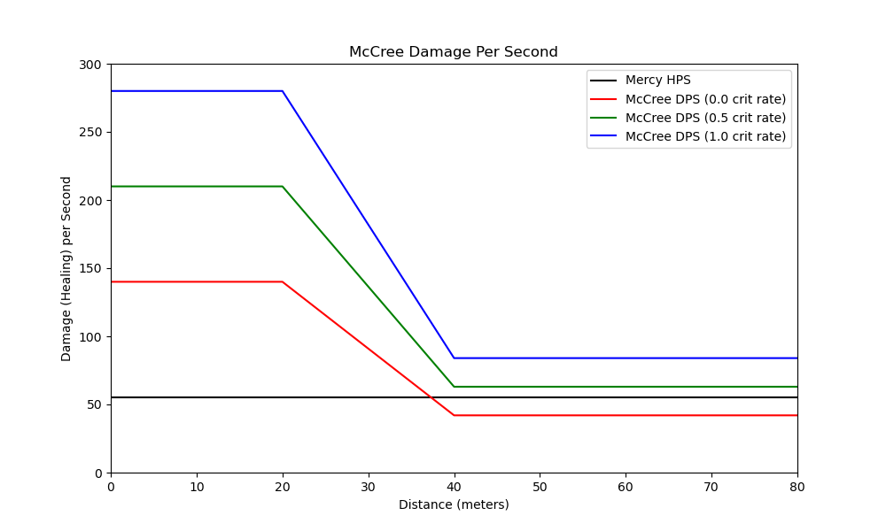  
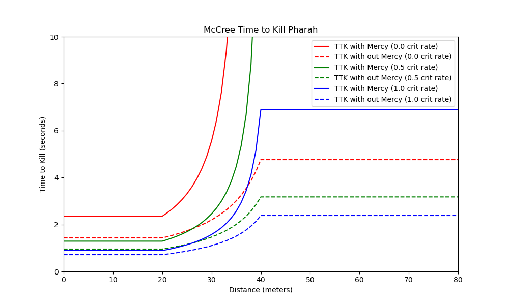  

##### McCree DPS and TTK under the new falloff changes compared to old falloff  
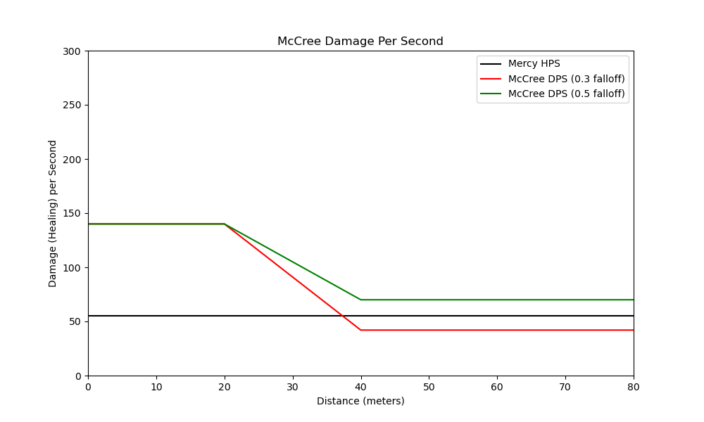  
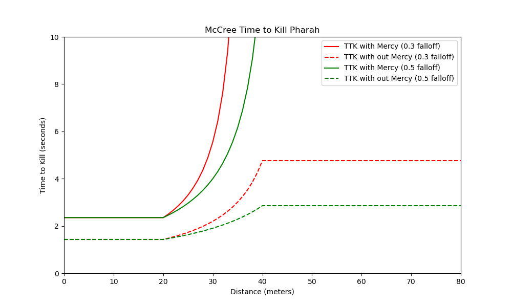

### 3.0 Soldier
Soldier's effective range is within 30 meters, his falloff range is between 30-50 meters, and while in his
effective range a shot does 19 damage and he shoots 9 shots per second

Under the new falloff changes:
```
Range at which Soldier can no longer kill Pharmacy with a crit rate of 0%: 50 meters

There is no range at which Soldier can not overcome mercy healing to kill Pharmacy with a crit rate of 50%
Due to the change Pharmacy TTK has increased from 1.559s to 2.599s at max falloff

There is no range at which Soldier can not overcome mercy healing to kill Pharmacy with a crit rate of 100%
Due to the change Pharmacy TTK has increased from 1.17s to 1.949s at max falloff
```
##### Soldier DPS and TTK under the new falloff changes  
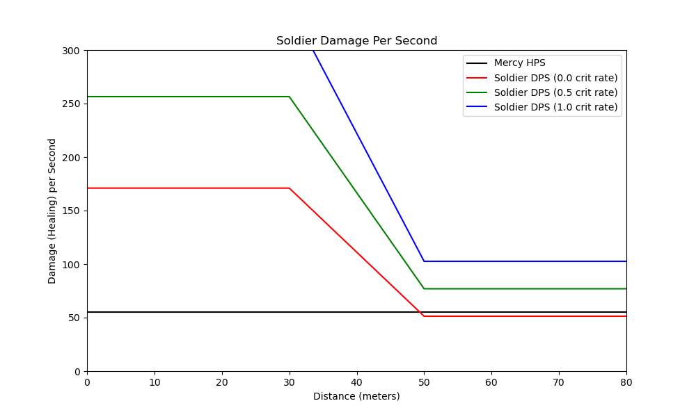  
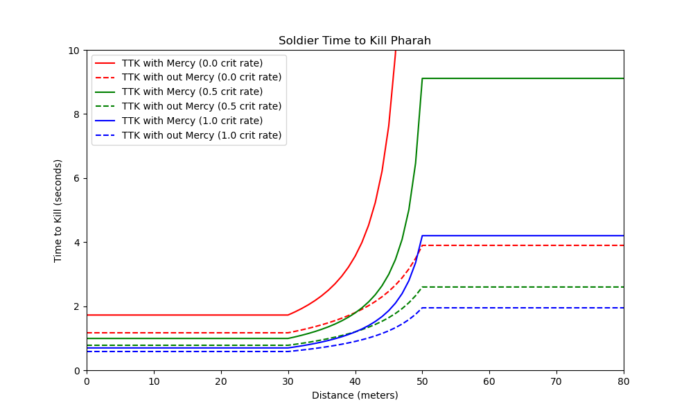  

##### Soldier DPS and TTK under the new falloff changes compared to old falloff  
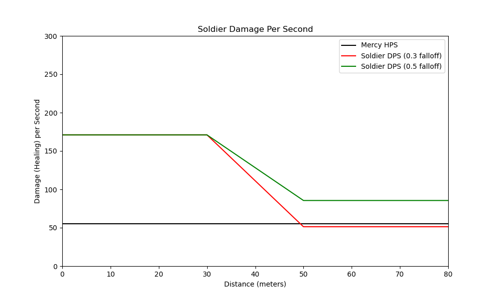  
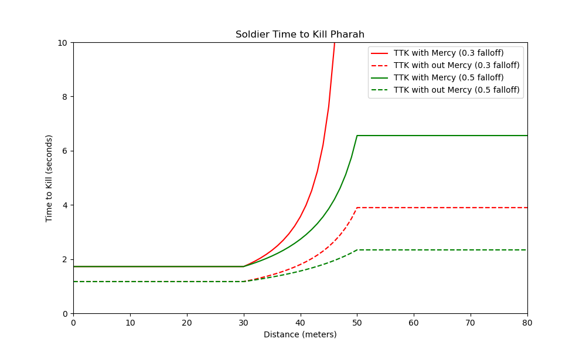

### 4.0 Baptiste
baptiste_falloff = (25, 45, 24, 3 / .58, 'Baptiste')

Baptiste's effective range is within 25 meters, his falloff range is between 25-45 meters, and while in his
effective range a shot does 24 damage. He can fire a 3 round burt ever .58 seconds resulting in ~5.12 shots per second.

Under the new falloff changes:
```
Range at which Baptiste can no longer kill Pharmacy with a crit rate of 0%: 41 meters

There is no range at which Baptiste can not overcome mercy healing to kill Pharmacy with a crit rate of 50%
Due to the change Pharmacy TTK has increased from 2.148s to 3.58s at max falloff

There is no range at which Baptiste can not overcome mercy healing to kill Pharmacy with a crit rate of 100%
Due to the change Pharmacy TTK has increased from 1.611s to 2.685s at max falloff
```
##### Baptiste DPS and TTK under the new falloff changes  
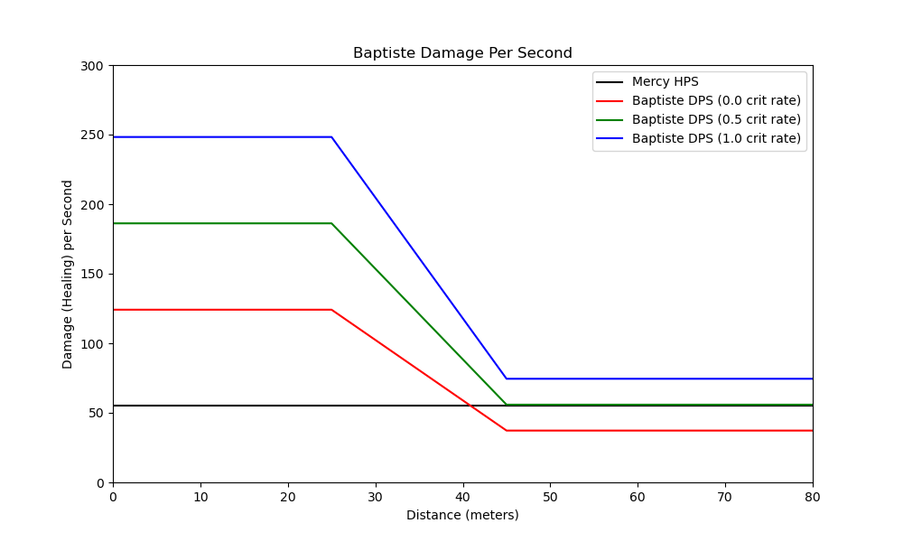  
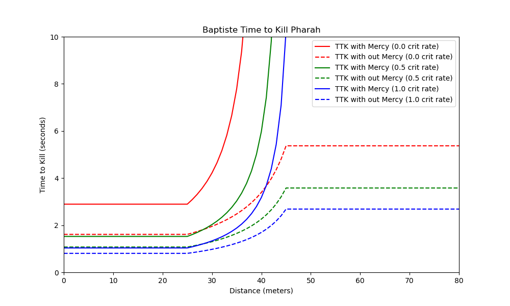  

##### Baptiste DPS and TTK under the new falloff changes compared to old falloff  
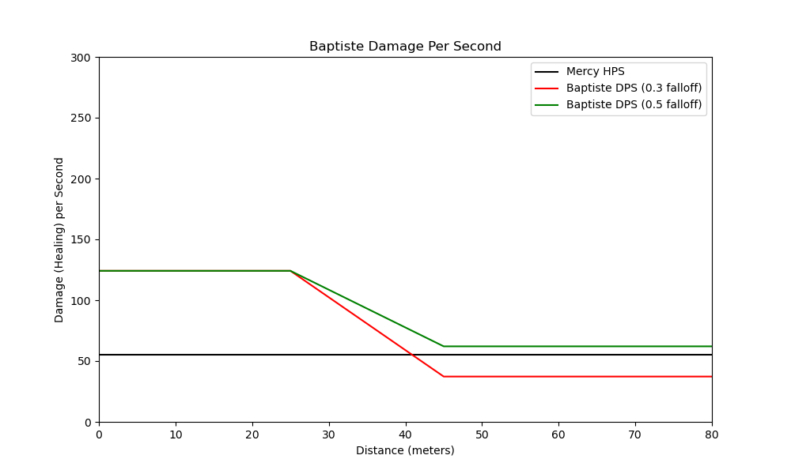  
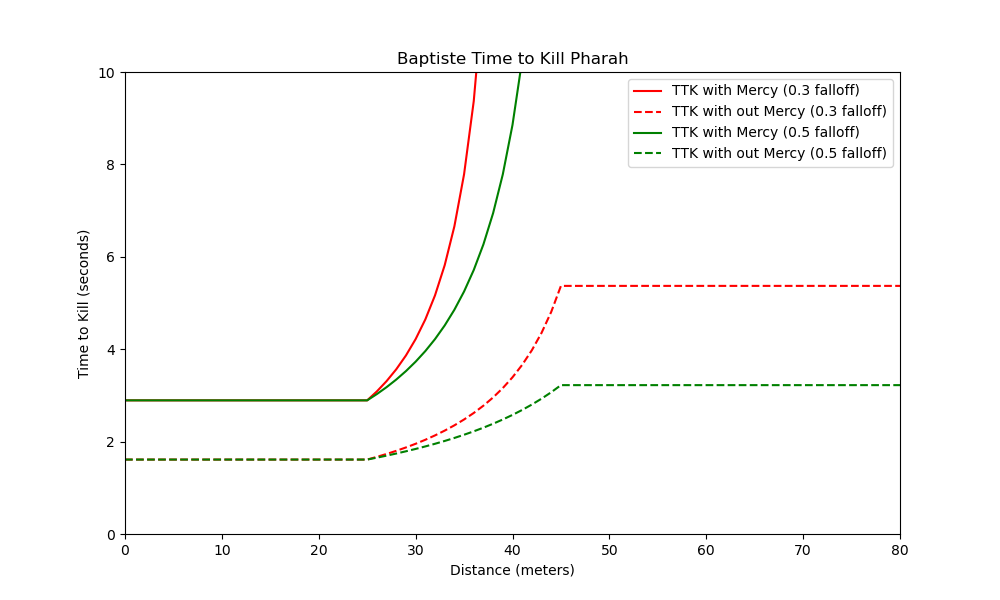