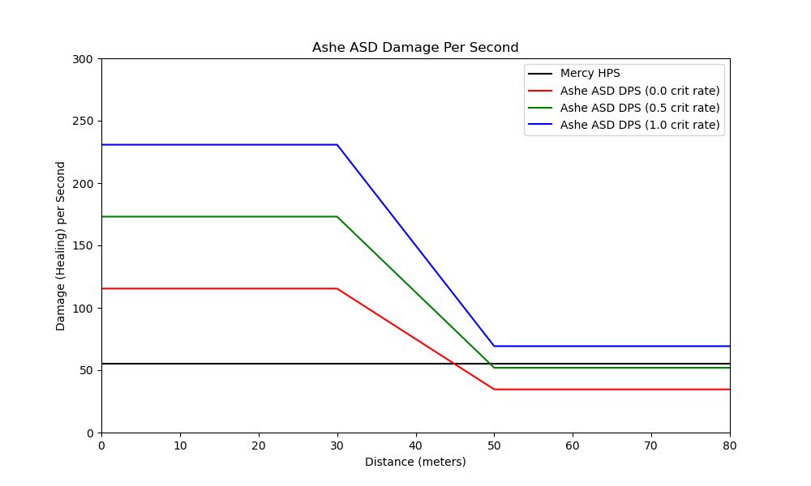
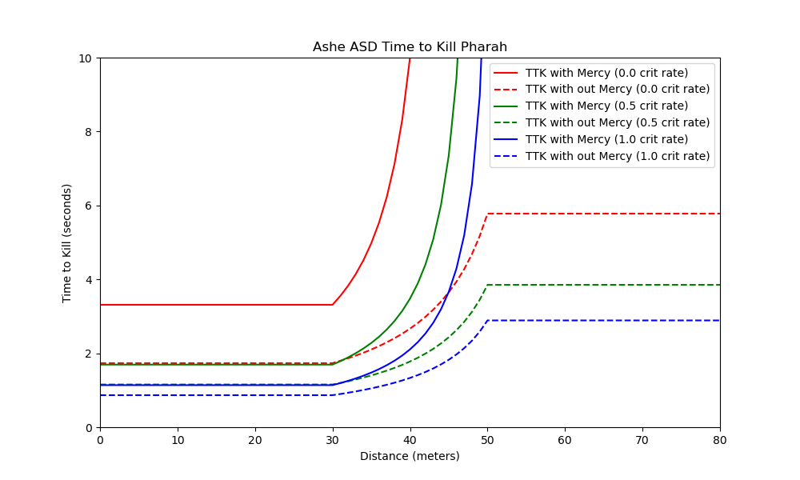
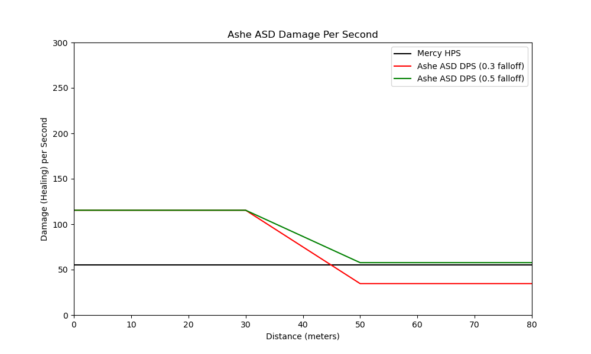
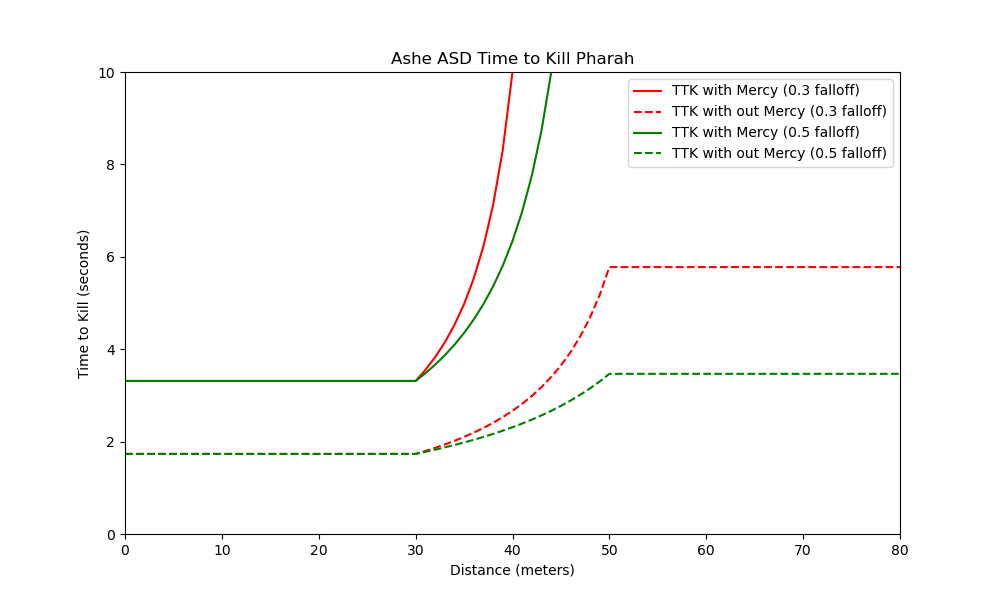
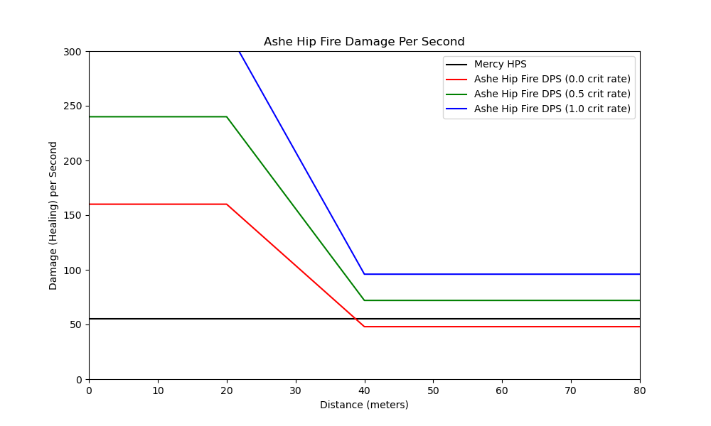
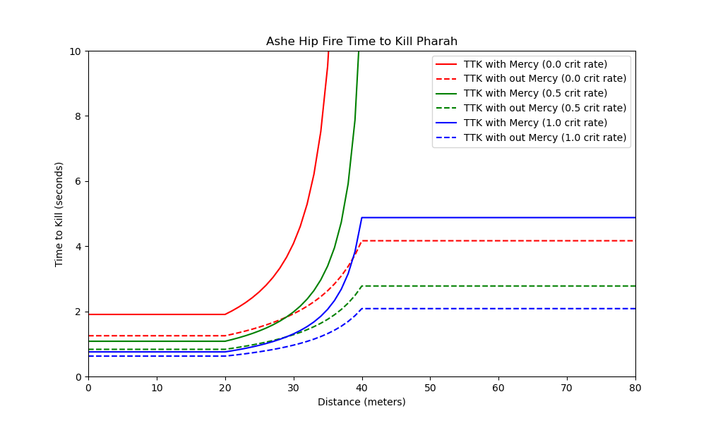
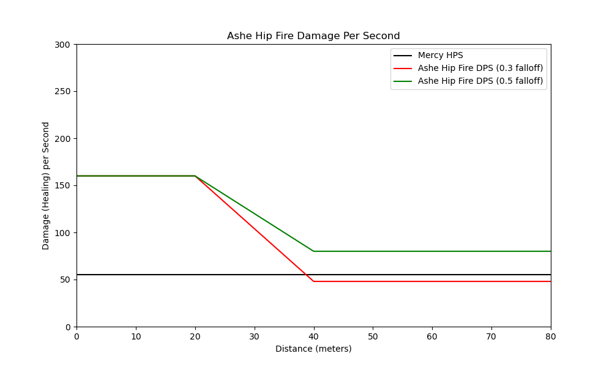
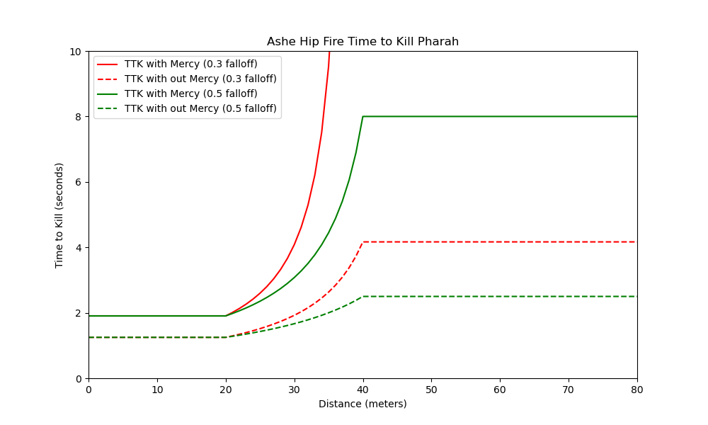

## An exploration of how the hitscan falloff nerf interacts with pharmacy
In this exploration we will be exploring how the most recent hitscan falloff changes
impact the ability for hitscan heroes to kill a Pharah with and without a mercy pocket.

### 0.0 The Change

```
Hitscan damage now scales to 30% at maximum falloff range, down from 50% for the following heroes:
- Ashe
- Baptiste
- Bastion
- McCree
- Soldier: 76
- Widowmaker
- Wrecking Ball
```
We will be assuming that falloff in overwatch is linear, or that the damage decrease from N + 0 to N + 1 meters is the 
same as the damage decrease from N + 1 meters to N + 2 meters.


### 0.1 Requirements
The code in this tutorial was written in python 3.7 and uses the following libraries:
python 3.7
The environment.yml page for the entire project contains everything you need to run this script.


### 1.0 Ashe
Ashe has two modes of fire, ASD and hip fire. We will explore both of these in this section.
#### ASD
When aiming down sights Ashes effective range is within 30 meters, her falloff range is between 30-50 meters, and while in her
effective range a shot does 75 damage. Her recovery time is .65 seconds, allowing her to shoot ~1.54 shots per second 

Under the new falloff changes:
```
Range at which Ashe ASD can no longer kill Pharmacy with a crit rate of %0.0: 45 meters

Range at which Ashe ASD can no longer kill Pharmacy with a crit rate of %50.0: 50 meters

There is no range at which Ashe ASD can not overcome mercy healing to kill Pharmacy with a crit rate of %100.0
Due to the change Pharmacy TTK has increased from 1.733s to 2.889s at max falloff
```
##### Ashe ASD DPS and TTK under the new falloff changes  
  
  

##### Ashe ASD DPS and TTK under the new falloff changes compared to old falloff  
  
  


#### Hip Fire
When firing from the hip Ashes effective range is within 20 meters, her falloff range is between 20-40 meters, and while in her
effective range a shot does 40 damage. Her recovery time is .25 seconds, allowing her to shoot 4 shots per second 

Under the new falloff changes:
```
Range at which Ashe Hip Fire can no longer kill Pharmacy with a crit rate of %0.0: 39 meters

There is no range at which Ashe Hip Fire can not overcome mercy healing to kill Pharmacy with a crit rate of %50.0
Due to the change Pharmacy TTK has increased from 1.667s to 2.778s at max falloff

There is no range at which Ashe Hip Fire can not overcome mercy healing to kill Pharmacy with a crit rate of %100.0
Due to the change Pharmacy TTK has increased from 1.25s to 2.083s at max falloff
```
##### Ashe ASD DPS and TTK under the new falloff changes  
  
  

##### Ashe ASD DPS and TTK under the new falloff changes compared to old falloff  
  
  
