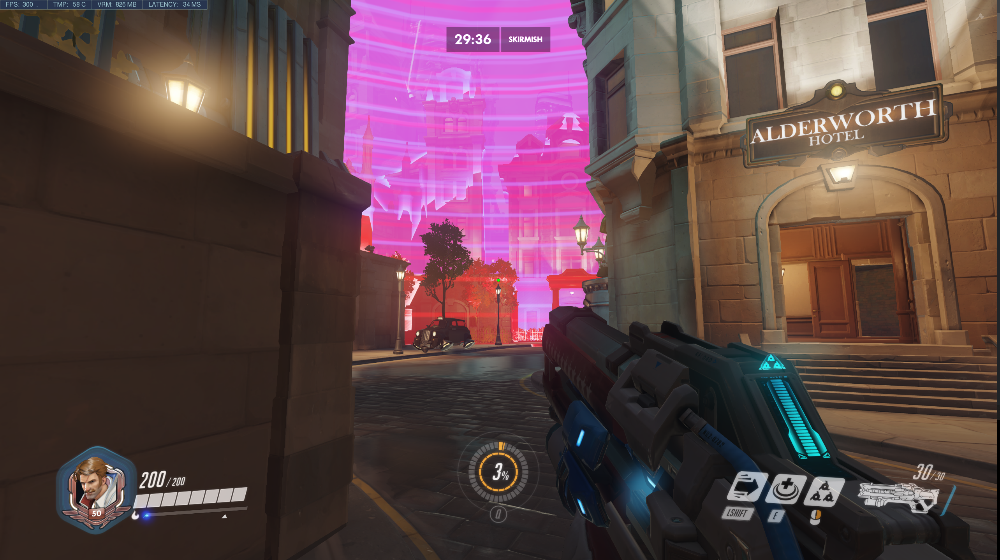

## An exploration of how the hitscan falloff nerf interacts with pharmacy
In this exploration we will be looking at how the most recent hitscan falloff changes
impact the ability for hitscan heroes to kill a Pharah with a mercy pocket. 

### 0.1 Requirements
The code in this tutorial was written in python 3.7 and uses the following libraries:  
python 3.7  
The environment.yml page for the entire project contains everything you need to run this script.  

The code used to generate the [TTK Graphs](./explore_with_reload.py) has been provided. I have also included a [previous writeup](./ResultsWithoutReload.md)
that did not account for reload time.

### 0.2 The Change

```
Hitscan damage now scales to 30% at maximum falloff range, down from 50% for the following heroes:
- Ashe
- Baptiste
- Bastion
- McCree
- Soldier: 76
- Widowmaker
- Wrecking Ball
```
We will be assuming that falloff in Overwatch is linear (damage decrease from N + 0 to N + 1 meters is the 
same as the damage decrease from N + 1 meters to N + 2 meters). We will also be assuming that the hitscan player does not miss any shots.

How this change impacts each here can be seen below.
1. [Ashe](#10-ashe)
2. [McCree](#20-mccree)
3. [Soldier](#30-soldier)
4. [Baptiste](#30-baptiste)

### 0.3 Workshop Code
I have created a simple workshop code so that you can go to a map and see what these distances actually look like in game.
`5QFXZ`

1. Select one of the heroes described in this exploration
2. Press `crouch` and a red sphere will appear centered at your location. It represents the maximum distance that hero could kill a mercy pocketed pharah with only body shots
3. Press `Ultimate` and a blue sphere will appear centered at your location. It represents the maximum distance that hero could kill a mercy pocketed pharah with only head shots
4. Press `Reload` to remove all spheres.




### 1.0 Ashe
Ashe has two modes of fire, ADS and hip fire. We will explore both of these in this section.
#### ADS
Stats:
 - Effective Range: 0-30 meters
 - Falloff Range: 30-50 meters
 - Base Damage: 75
 - Recovery Time: .65 seconds

Under the new falloff changes the maximum range that Ashe can kill a Pharah with a mercy pocket is:
```
At a distance of 39 Meters, crit rate of 0.0, and a falloff of 0.3, Ashe ADS can kill a Pharah with a mercy pocket after 6.51 seconds
At a distance of 46 Meters, crit rate of 0.5, and a falloff of 0.3, Ashe ADS can kill a Pharah with a mercy pocket after 7.16 seconds
At a distance of 49 Meters, crit rate of 1.0, and a falloff of 0.3, Ashe ADS can kill a Pharah with a mercy pocket after 7.16 seconds
```
Compared to the old falloff
```
At a distance of 43 Meters, crit rate of 0.0, and a falloff of 0.5, Ashe ADS can kill a Pharah with a mercy pocket after 7.16 seconds
At a distance of 50+ Meters, crit rate of 0.5, and a falloff of 0.5, Ashe ADS can kill a Pharah with a mercy pocket after 5.21 seconds
At a distance of 50+ Meters, crit rate of 1.0, and a falloff of 0.5, Ashe ADS can kill a Pharah with a mercy pocket after 2.61 seconds
```
##### Ashe ADS TTK under the new falloff changes  


#### Hip Fire
Stats:
 - Effective Range: 0-20 meters
 - Falloff Range: 20-40 meters
 - Base Damage: 40
 - Recovery Time: .25 seconds

Under the new falloff changes the maximum range that Ashe can kill a Pharah with a mercy pocket is:
```
At a distance of 27 Meters, crit rate of 0.0, and a falloff of 0.3, Ashe Hip Fire can kill a Pharah with a mercy pocket after 2.76 seconds
At a distance of 34 Meters, crit rate of 0.5, and a falloff of 0.3, Ashe Hip Fire can kill a Pharah with a mercy pocket after 2.76 seconds
At a distance of 38 Meters, crit rate of 1.0, and a falloff of 0.3, Ashe Hip Fire can kill a Pharah with a mercy pocket after 2.76 seconds
```
Compared to the old falloff
```
At a distance of 30 Meters, crit rate of 0.0, and a falloff of 0.5, Ashe Hip Fire can kill a Pharah with a mercy pocket after 2.76 seconds
At a distance of 50+ Meters, crit rate of 0.5, and a falloff of 0.5, Ashe Hip Fire can kill a Pharah with a mercy pocket after 2.76 seconds
At a distance of 50+ Meters, crit rate of 1.0, and a falloff of 0.5, Ashe Hip Fire can kill a Pharah with a mercy pocket after 1.76 seconds
```
##### Ashe Hip Fire TTK under the new falloff changes  
  


### 2.0 McCree
Stats:
 - Effective Range: 0-20 meters
 - Falloff Range: 20-40 meters
 - Base Damage: 70
 - Recovery Time: .5 seconds

Under the new falloff changes the maximum range that McCree can kill a Pharah with a mercy pocket is:
```
At a distance of 33 Meters, crit rate of 0.0, and a falloff of 0.3, McCree can kill a Pharah with a mercy pocket after 17.51 seconds
At a distance of 38 Meters, crit rate of 0.5, and a falloff of 0.3, McCree can kill a Pharah with a mercy pocket after 17.01 seconds
At a distance of 40+ Meters, crit rate of 1.0, and a falloff of 0.3, McCree can kill a Pharah with a mercy pocket after 10.01 seconds
```
Compared to the old falloff
```
At a distance of 38 Meters, crit rate of 0.0, and a falloff of 0.5, McCree can kill a Pharah with a mercy pocket after 17.51 seconds
At a distance of 40+ Meters, crit rate of 0.5, and a falloff of 0.5, McCree can kill a Pharah with a mercy pocket after 6.51 seconds
At a distance of 40+ Meters, crit rate of 1.0, and a falloff of 0.5, McCree can kill a Pharah with a mercy pocket after 2.01 seconds
```
##### McCree TTK under the new falloff changes  
  

### 3.0 Soldier
Stats:
 - Effective Range: 0-30 meters
 - Falloff Range: 30-50 meters
 - Base Damage: 19
 - Recovery Time: 9 shots per second

Under the new falloff changes the maximum range that McCree can kill a Pharah with a mercy pocket is:
```
At a distance of 39 Meters, crit rate of 0.0, and a falloff of 0.3, Soldier can kill a Pharah with a mercy pocket after 2.98 seconds
At a distance of 46 Meters, crit rate of 0.5, and a falloff of 0.3, Soldier can kill a Pharah with a mercy pocket after 3.2 seconds
At a distance of 49 Meters, crit rate of 1.0, and a falloff of 0.3, Soldier can kill a Pharah with a mercy pocket after 3.2 seconds
```
Compared to the old falloff
```
At a distance of 43 Meters, crit rate of 0.0, and a falloff of 0.5, Soldier can kill a Pharah with a mercy pocket after 3.09 seconds
At a distance of 50+ Meters, crit rate of 0.5, and a falloff of 0.5, Soldier can kill a Pharah with a mercy pocket after 2.54 seconds
At a distance of 50+ Meters, crit rate of 1.0, and a falloff of 0.5, Soldier can kill a Pharah with a mercy pocket after 1.66 seconds
```
##### Soldier TTK under the new falloff changes  
  

### 4.0 Baptiste
Stats:
 - Effective Range: 0-25 meters
 - Falloff Range: 25-45 meters
 - Base Damage: 24 per bullet (3 round burst)
 - Recovery Time: .58 seconds

Under the new falloff changes the maximum range that McCree can kill a Pharah with a mercy pocket is:
```
At a distance of 37 Meters, crit rate of 0.0, and a falloff of 0.3, Baptiste can kill a Pharah with a mercy pocket after 13.69 seconds
At a distance of 43 Meters, crit rate of 0.5, and a falloff of 0.3, Baptiste can kill a Pharah with a mercy pocket after 15.97 seconds
At a distance of 45+ Meters, crit rate of 1.0, and a falloff of 0.3, Baptiste can kill a Pharah with a mercy pocket after 7.99 seconds
```
Compared to the old falloff
```
At a distance of 42 Meters, crit rate of 0.0, and a falloff of 0.5, Baptiste can kill a Pharah with a mercy pocket after 14.26 seconds
At a distance of 45+ Meters, crit rate of 0.5, and a falloff of 0.5, Baptiste can kill a Pharah with a mercy pocket after 4.0 seconds
At a distance of 45+ Meters, crit rate of 1.0, and a falloff of 0.5, Baptiste can kill a Pharah with a mercy pocket after 2.29 seconds
```
##### Baptiste TTK under the new falloff changes  
