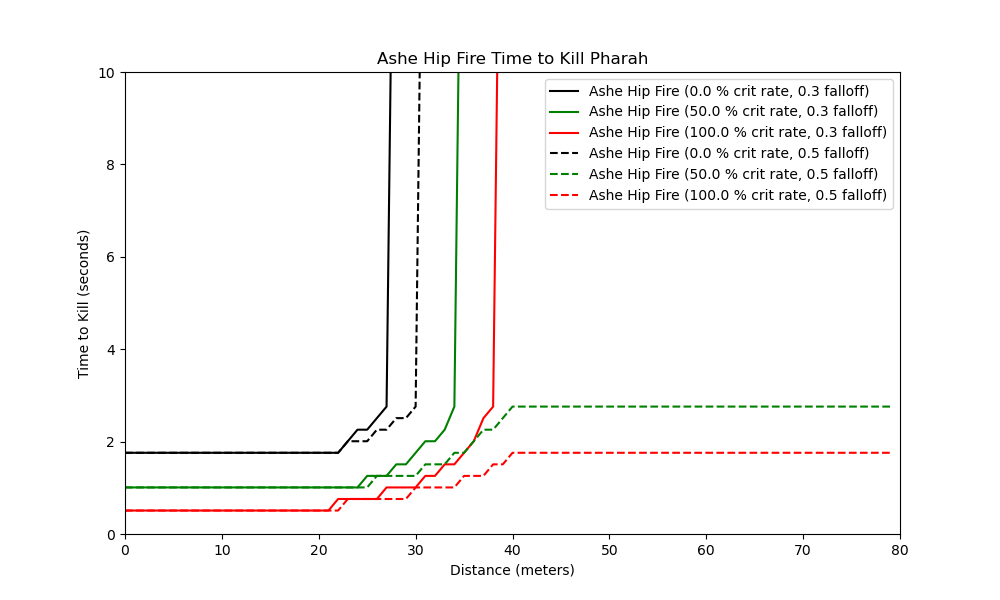
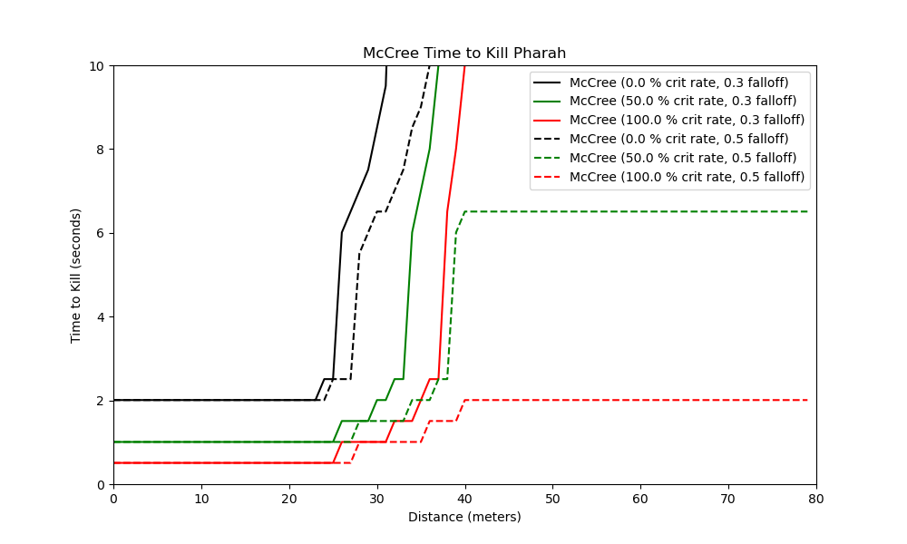

## An exploration of how the hitscan falloff nerf interacts with pharmacy
In this exploration we will be looking at how the most recent hitscan falloff changes
impact the ability for hitscan heroes to kill a Pharah with and without a mercy pocket. 

### 0.1 Requirements
The code in this tutorial was written in python 3.7 and uses the following libraries:  
python 3.7  
The environment.yml page for the entire project contains everything you need to run this script.  

The code used to generate the [DPS and TTK Graphs](./killing_pharmacy.py), the [Comparison Pre and Post Patch](./killing_pharmacy_compare.py), and
determining the [break points](./explore.py) are all provided with annotations.

### 0.2 The Change

```
Hitscan damage now scales to 30% at maximum falloff range, down from 50% for the following heroes:
- Ashe
- Baptiste
- Bastion
- McCree
- Soldier: 76
- Widowmaker
- Wrecking Ball
```
We will be assuming that falloff in overwatch is linear, or that the damage decrease from N + 0 to N + 1 meters is the 
same as the damage decrease from N + 1 meters to N + 2 meters. We will also be assuming that the hitscan player does not miss any shots.

How this change impacts each here can be seen below.
1. [Ashe](#10-ashe)
2. [McCree](#20-mccree)
3. [Soldier](#30-soldier)
4. [Baptiste](#30-baptiste)

### 1.0 Ashe
Ashe has two modes of fire, ASD and hip fire. We will explore both of these in this section.
#### ASD
When aiming down sights Ashe's effective range is within 30 meters, her falloff range is between 30-50 meters, and while in her
effective range a shot does 75 damage. Her recovery time is .65 seconds, allowing her to shoot ~1.54 shots per second 

Under the new falloff changes the maximum range that Ashe can kill a Pharah with a mercy pocket is:
```
At a distance of 39 Meters, crit rate of 0.0, and a falloff of 0.3, Ashe ASD can kill a Pharah with a mercy pocket after 6.51 seconds
At a distance of 46 Meters, crit rate of 0.5, and a falloff of 0.3, Ashe ASD can kill a Pharah with a mercy pocket after 7.16 seconds
At a distance of 49 Meters, crit rate of 1.0, and a falloff of 0.3, Ashe ASD can kill a Pharah with a mercy pocket after 7.16 seconds
```
Compared to the old falloff
```
At a distance of 43 Meters, crit rate of 0.0, and a falloff of 0.5, Ashe ASD can kill a Pharah with a mercy pocket after 7.16 seconds
At a distance of 50+ Meters, crit rate of 0.5, and a falloff of 0.5, Ashe ASD can kill a Pharah with a mercy pocket after 5.21 seconds
At a distance of 50+ Meters, crit rate of 1.0, and a falloff of 0.5, Ashe ASD can kill a Pharah with a mercy pocket after 2.61 seconds
```
##### Ashe ASD TTK under the new falloff changes  
  

#### Hip Fire
When firing from the hip Ashe's effective range is within 20 meters, her falloff range is between 20-40 meters, and while in her
effective range a shot does 40 damage. Her recovery time is .25 seconds, allowing her to shoot 4 shots per second 

Under the new falloff changes the maximum range that Ashe can kill a Pharah with a mercy pocket is:
```
At a distance of 27 Meters, crit rate of 0.0, and a falloff of 0.3, Ashe Hip Fire can kill a Pharah with a mercy pocket after 2.76 seconds
At a distance of 34 Meters, crit rate of 0.5, and a falloff of 0.3, Ashe Hip Fire can kill a Pharah with a mercy pocket after 2.76 seconds
At a distance of 38 Meters, crit rate of 1.0, and a falloff of 0.3, Ashe Hip Fire can kill a Pharah with a mercy pocket after 2.76 seconds
```
Compared to the old falloff
```
At a distance of 30 Meters, crit rate of 0.0, and a falloff of 0.5, Ashe Hip Fire can kill a Pharah with a mercy pocket after 2.76 seconds
At a distance of 50+ Meters, crit rate of 0.5, and a falloff of 0.5, Ashe Hip Fire can kill a Pharah with a mercy pocket after 2.76 seconds
At a distance of 50+ Meters, crit rate of 1.0, and a falloff of 0.5, Ashe Hip Fire can kill a Pharah with a mercy pocket after 1.76 seconds
```
##### Ashe Hip Fire TTK under the new falloff changes  
  


### 2.0 McCree
McCree's effective range is within 20 meters, his falloff range is between 20-40 meters, and while in his
effective range a shot does 70 damage. His recovery time is .5 seconds, allowing him to shoot 2 shots per second 

Under the new falloff changes the maximum range that McCree can kill a Pharah with a mercy pocket is:
```
At a distance of 33 Meters, crit rate of 0.0, and a falloff of 0.3, McCree can kill a Pharah with a mercy pocket after 17.51 seconds
At a distance of 38 Meters, crit rate of 0.5, and a falloff of 0.3, McCree can kill a Pharah with a mercy pocket after 17.01 seconds
At a distance of 40+ Meters, crit rate of 1.0, and a falloff of 0.3, McCree can kill a Pharah with a mercy pocket after 10.01 seconds
```
Compared to the old falloff
```
At a distance of 38 Meters, crit rate of 0.0, and a falloff of 0.5, McCree can kill a Pharah with a mercy pocket after 17.51 seconds
At a distance of 40+ Meters, crit rate of 0.5, and a falloff of 0.5, McCree can kill a Pharah with a mercy pocket after 6.51 seconds
At a distance of 40+ Meters, crit rate of 1.0, and a falloff of 0.5, McCree can kill a Pharah with a mercy pocket after 2.01 seconds
```
##### McCree TTK under the new falloff changes  
  

### 3.0 Soldier
Soldier's effective range is within 30 meters, his falloff range is between 30-50 meters, and while in his
effective range a shot does 19 damage and he shoots 9 shots per second

Under the new falloff changes the maximum range that McCree can kill a Pharah with a mercy pocket is:
```
At a distance of 39 Meters, crit rate of 0.0, and a falloff of 0.3, Soldier can kill a Pharah with a mercy pocket after 2.98 seconds
At a distance of 46 Meters, crit rate of 0.5, and a falloff of 0.3, Soldier can kill a Pharah with a mercy pocket after 3.2 seconds
At a distance of 49 Meters, crit rate of 1.0, and a falloff of 0.3, Soldier can kill a Pharah with a mercy pocket after 3.2 seconds
```
Compared to the old falloff
```
At a distance of 43 Meters, crit rate of 0.0, and a falloff of 0.5, Soldier can kill a Pharah with a mercy pocket after 3.09 seconds
At a distance of 50+ Meters, crit rate of 0.5, and a falloff of 0.5, Soldier can kill a Pharah with a mercy pocket after 2.54 seconds
At a distance of 50+ Meters, crit rate of 1.0, and a falloff of 0.5, Soldier can kill a Pharah with a mercy pocket after 1.66 seconds
```
##### Soldier TTK under the new falloff changes  
  

### 4.0 Baptiste
Baptiste's effective range is within 25 meters, his falloff range is between 25-45 meters, and while in his
effective range a shot does 24 damage. He can fire a 3 round burt ever .58 seconds resulting in ~5.12 shots per second.

Under the new falloff changes the maximum range that McCree can kill a Pharah with a mercy pocket is:
```
At a distance of 37 Meters, crit rate of 0.0, and a falloff of 0.3, Baptiste can kill a Pharah with a mercy pocket after 13.69 seconds
At a distance of 43 Meters, crit rate of 0.5, and a falloff of 0.3, Baptiste can kill a Pharah with a mercy pocket after 15.97 seconds
At a distance of 45+ Meters, crit rate of 1.0, and a falloff of 0.3, Baptiste can kill a Pharah with a mercy pocket after 7.99 seconds
```
Compared to the old falloff
```
At a distance of 42 Meters, crit rate of 0.0, and a falloff of 0.5, Baptiste can kill a Pharah with a mercy pocket after 14.26 seconds
At a distance of 45+ Meters, crit rate of 0.5, and a falloff of 0.5, Baptiste can kill a Pharah with a mercy pocket after 4.0 seconds
At a distance of 45+ Meters, crit rate of 1.0, and a falloff of 0.5, Baptiste can kill a Pharah with a mercy pocket after 2.29 seconds
```
##### Baptiste TTK under the new falloff changes  
  