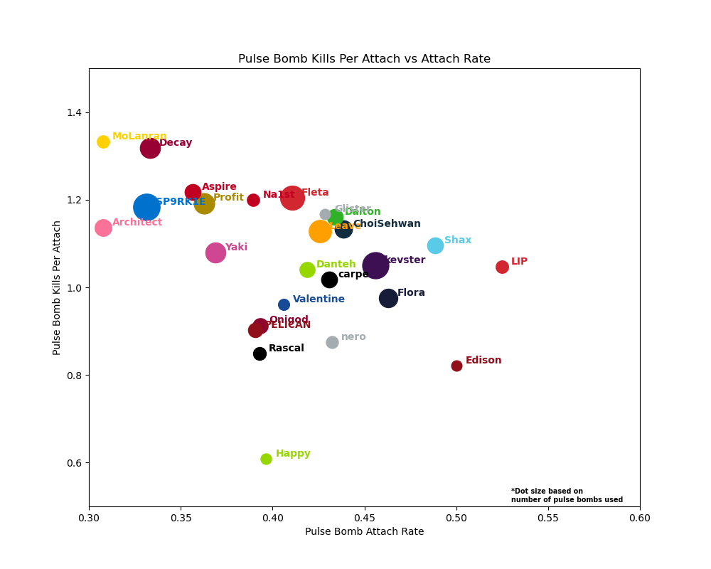
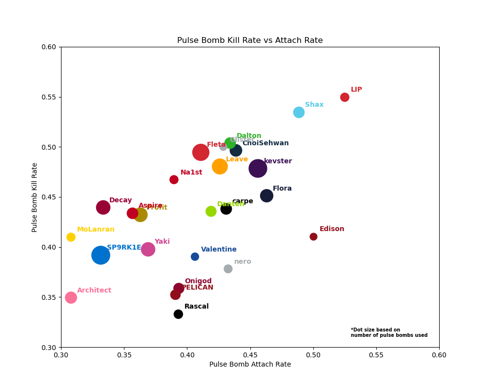

## Pulse Bomb Kills Per Stick vs Attach Rate

From this plot the following trends can be assumed but not confirmed without watching replays to confirm

1. Players in the upper right quadrant are sticking low HP targets at a high rate
2. Players in the lower right quadrant are sticking tanks at a high rate
3. Players in the upper left quadrant are attempting to stick low HP targets but are not accurate
4. Players in the lower left quadrant are attempting to stick tanks but are not accurate

## Pulse Bomb Kill Rate vs Attach Rate

This chart just gives us an idea of the efficiency of pulse bomb usage for each player.
